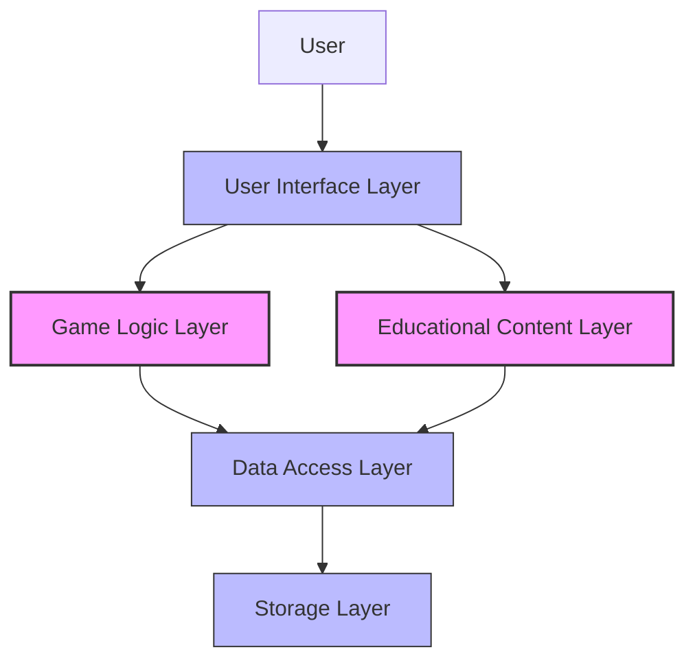
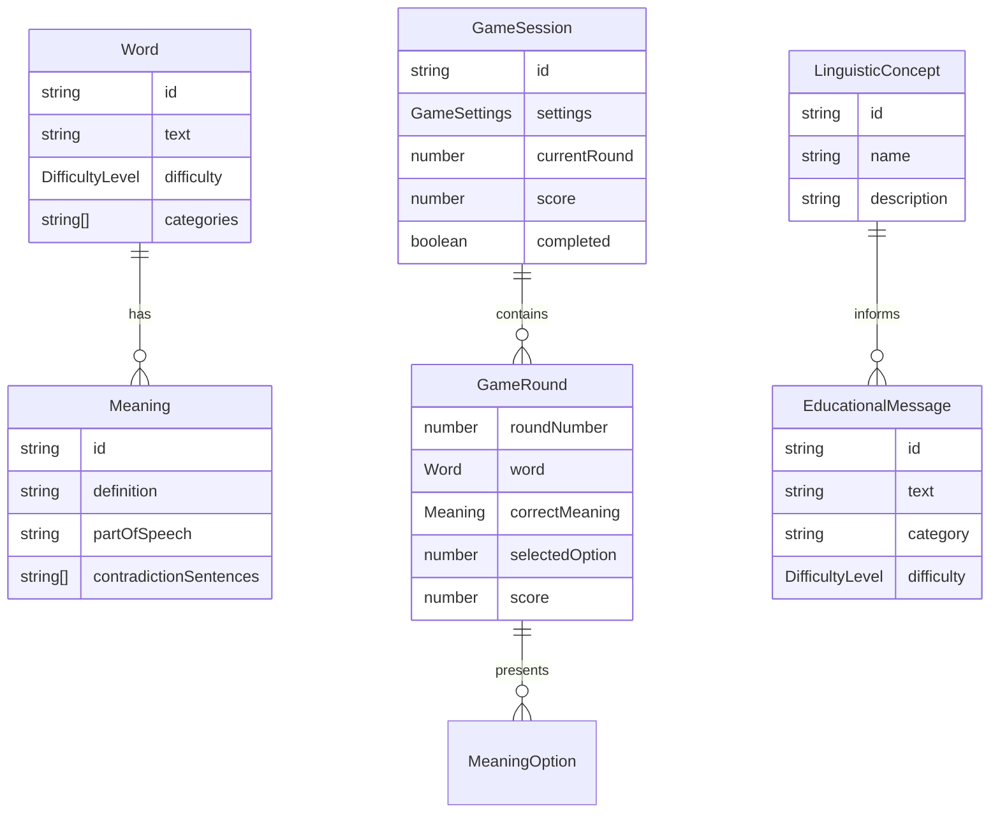
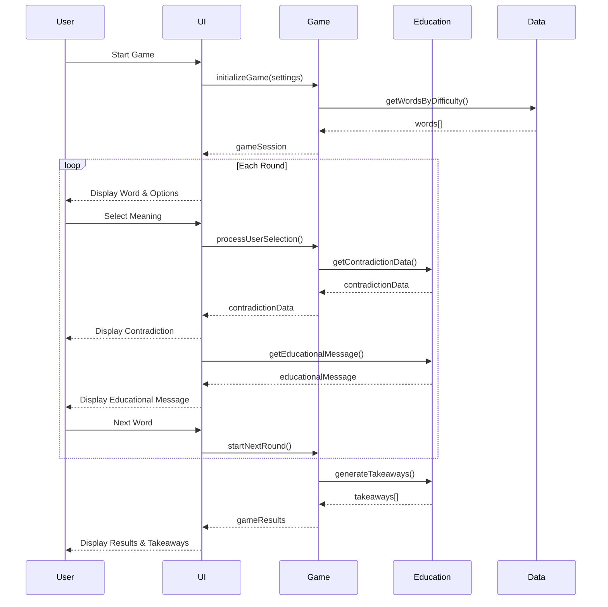
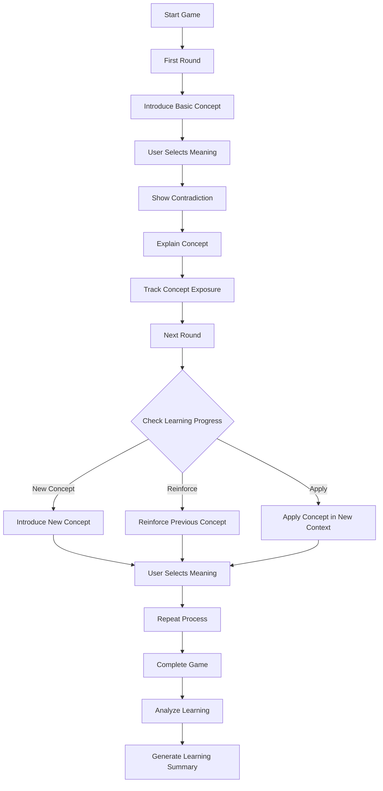

# Words Without Meaning: Architecture Summary & Implementation Guidelines

This document provides a concise summary of the architecture for the "Words Without Meaning" game and offers practical guidelines for implementation. It serves as an executive overview of the architectural design and a roadmap for development.

## 1. Architecture Overview

The "Words Without Meaning" game architecture is designed to create an educational experience that demonstrates how words derive meaning from context. The system is organized into five primary layers:

### 1.1 Key Architectural Components

1. **User Interface Layer**: Presents the game to users and handles interactions
2. **Game Logic Layer**: Implements core game mechanics and manages game state
3. **Educational Content Layer**: Manages educational aspects and learning progression
4. **Data Access Layer**: Provides unified access to data across the application
5. **Storage Layer**: Handles persistent storage of data

### 1.2 Core Design Principles

1. **Separation of Concerns**: Clear boundaries between UI, game logic, educational content, and data
2. **Modularity**: Components with well-defined interfaces that can be developed independently
3. **Educational Focus**: Architecture decisions prioritize educational effectiveness
4. **Offline-First**: Core functionality available without internet connectivity
5. **Accessibility**: Design accommodates users with different abilities

## 2. Key Data Structures

The architecture is built around these core data structures:

## 3. Core Flows

### 3.1 Game Flow

### 3.2 Educational Flow

## 4. Technology Stack

### 4.1 Recommended Technologies

| Component | Recommended Technology | Alternatives |
|-----------|------------------------|--------------|
| **Frontend Framework** | React with TypeScript | Vue.js, Svelte |
| **State Management** | Redux Toolkit with Redux Persist | Context API, MobX |
| **Styling** | Styled Components with Tailwind CSS | CSS Modules, Emotion |
| **Storage** | IndexedDB with Dexie.js | LocalForage, Firebase |
| **Build & Development** | Vite | Create React App, Next.js |
| **Testing** | Jest with React Testing Library | Vitest, Cypress |

### 4.2 Technology Selection Rationale

1. **React with TypeScript**
   - Component-based architecture aligns with our modular design
   - Strong typing improves code quality and maintainability
   - Large ecosystem and community support

2. **Redux Toolkit with Redux Persist**
   - Centralized state management simplifies data flow
   - Redux Persist enables offline functionality
   - Redux Toolkit reduces boilerplate code

3. **IndexedDB with Dexie.js**
   - Supports complex data structures needed for word database
   - Efficient querying capabilities
   - Handles large datasets well

## 5. Implementation Guidelines

### 5.1 Implementation Phases

#### Phase 1: Foundation (2-3 weeks)
- Set up project structure and technology stack
- Implement core data structures
- Create basic UI components
- Implement word database with initial data (50-100 words)
- Develop core game logic

#### Phase 2: Enhanced Gameplay (3-4 weeks)
- Expand word database (all 500 words)
- Implement educational content service
- Enhance UI with animations and transitions
- Add sound effects and visual feedback
- Implement difficulty levels

#### Phase 3: Polish and Optimization (2-3 weeks)
- Optimize performance
- Implement accessibility features
- Conduct cross-platform testing
- Fix bugs and refine user experience
- Add analytics (optional)

### 5.2 Development Priorities

1. **Word Database**: The foundation of the game
   - Implement database schema
   - Create initial word data with multiple meanings
   - Ensure contradiction sentences are effective

2. **Game Logic**: The core mechanics
   - Implement game session management
   - Develop round management
   - Create word selection service
   - Implement scoring system

3. **Educational Content**: The learning experience
   - Develop educational message service
   - Implement learning progression tracking
   - Create takeaway generation

4. **User Interface**: The interaction layer
   - Implement screen components
   - Create reusable UI components
   - Develop animations and transitions

### 5.3 Implementation Checklist

#### Data Layer
- [ ] Define IndexedDB schema
- [ ] Implement data access repositories
- [ ] Create data migration strategy
- [ ] Implement data validation

#### Game Logic Layer
- [ ] Implement game session management
- [ ] Develop round management
- [ ] Create word selection service
- [ ] Implement scoring system
- [ ] Develop timer service

#### Educational Content Layer
- [ ] Implement educational message service
- [ ] Develop concept explanation service
- [ ] Create learning progression tracker
- [ ] Implement takeaway generator

#### User Interface Layer
- [ ] Create screen components
- [ ] Implement reusable UI components
- [ ] Develop animations and transitions
- [ ] Implement accessibility features

#### Testing
- [ ] Set up unit testing framework
- [ ] Create component tests
- [ ] Implement integration tests
- [ ] Develop accessibility tests

## 6. Security & Scalability Considerations

### 6.1 Security Measures

1. **Data Security**
   - Encrypt any sensitive user data
   - Implement data minimization principles
   - Clear sensitive data when no longer needed

2. **Web Security**
   - Implement Content Security Policy
   - Validate all user inputs
   - Keep dependencies updated

3. **Privacy Considerations**
   - Implement clear data collection policy
   - Obtain explicit consent before collecting data
   - Use anonymized data for analytics

### 6.2 Scalability Strategies

1. **Content Scalability**
   - Partition word database by difficulty level
   - Implement efficient indexing in IndexedDB
   - Use lazy loading for word details

2. **Performance Scalability**
   - Optimize component rendering
   - Implement efficient state management
   - Use code splitting and lazy loading

3. **Feature Scalability**
   - Implement feature flags for gradual rollout
   - Design extensible plugin system
   - Use modular architecture

## 7. Educational Effectiveness

### 7.1 Educational Design Principles

1. **Experiential Learning**
   - Users learn through direct experience with contradictions
   - Learning cycle: experience → reflection → conceptualization → application

2. **Progressive Disclosure**
   - Start with simple concepts
   - Gradually introduce more complex ideas
   - Adapt to user's learning progress

3. **Spaced Repetition**
   - Reinforce concepts at optimal intervals
   - Track concept exposure
   - Adapt reinforcement timing based on performance

### 7.2 Educational Effectiveness Measurement

1. **Learning Outcome Metrics**
   - Concept understanding
   - Meaning recognition
   - Context sensitivity
   - Overall learning gains

2. **Engagement Metrics**
   - Session duration
   - Completion rate
   - Return rate
   - Difficulty progression

## 8. Implementation Recommendations

### 8.1 Development Approach

1. **Iterative Development**
   - Start with a minimal viable product
   - Add features incrementally
   - Test with users frequently

2. **Component-First Development**
   - Develop and test components in isolation
   - Use storybook or similar tool for component development
   - Integrate components into screens

3. **Test-Driven Development**
   - Write tests before implementing features
   - Ensure high test coverage
   - Use automated testing in CI/CD pipeline

### 8.2 Key Implementation Challenges

1. **Word Database Quality**
   - Ensure words have genuinely different meanings
   - Create clear, effective contradiction sentences
   - Balance difficulty levels appropriately

2. **Educational Content Integration**
   - Seamlessly integrate educational messages into gameplay
   - Make learning moments impactful without disrupting flow
   - Balance educational content with engagement

3. **Offline Functionality**
   - Ensure complete functionality without internet
   - Manage database size for efficient storage
   - Handle state persistence correctly

### 8.3 Technical Debt Prevention

1. **Code Quality Standards**
   - Establish coding standards early
   - Use linting and formatting tools
   - Conduct regular code reviews

2. **Documentation**
   - Document architecture decisions
   - Create component documentation
   - Maintain API documentation

3. **Refactoring Strategy**
   - Schedule regular refactoring sessions
   - Address technical debt proactively
   - Maintain high test coverage to enable safe refactoring

## 9. Conclusion

The architecture for "Words Without Meaning" provides a solid foundation for implementing an educational game that effectively demonstrates how words derive meaning from context. By following the implementation guidelines and focusing on the educational objectives, the development team can create a game that is both engaging and educationally valuable.

Key success factors for implementation:

1. **Focus on Educational Effectiveness**: Prioritize features that enhance learning
2. **Maintain Modularity**: Keep components loosely coupled with clear interfaces
3. **Iterative Development**: Build incrementally and test frequently
4. **User-Centered Design**: Design for the target audience's needs and abilities
5. **Quality Content**: Ensure the word database and educational content are high quality

By adhering to these principles and following the implementation guidelines, the development team can successfully create a game that achieves its educational objectives while providing an engaging user experience.