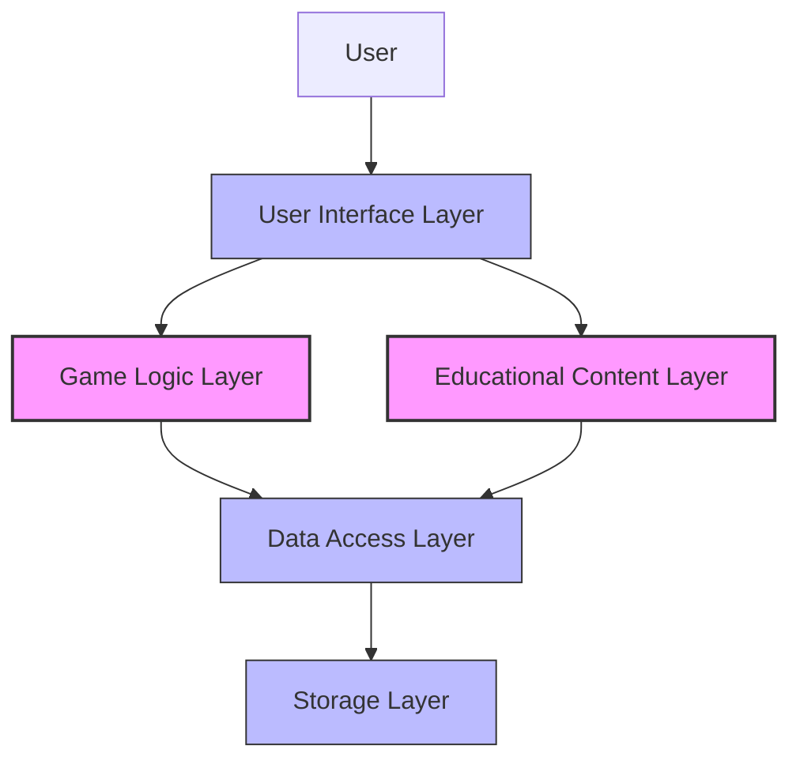
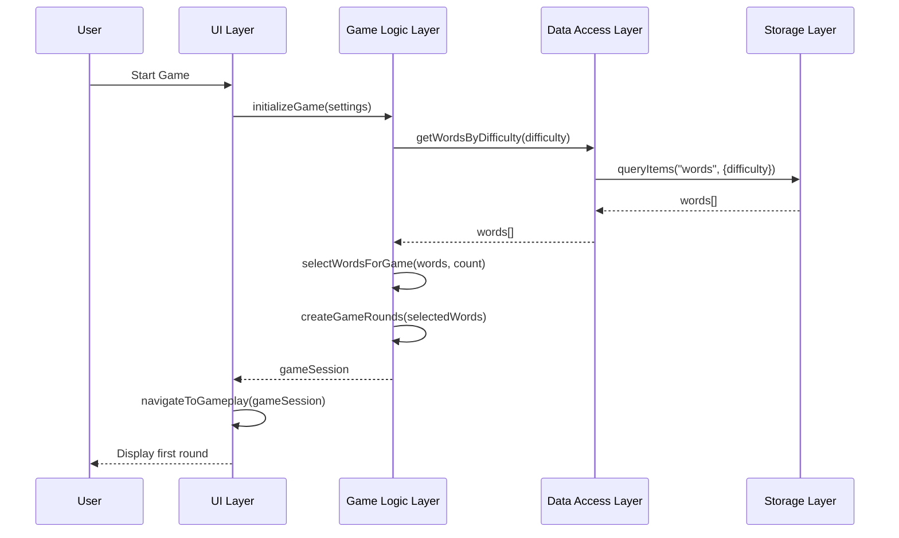
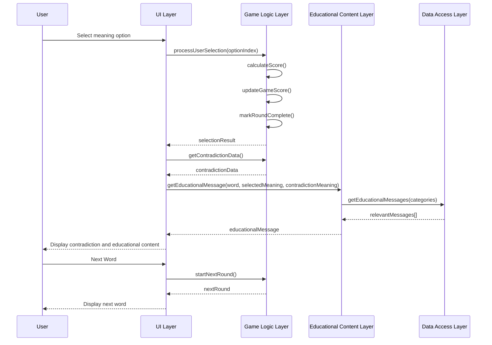
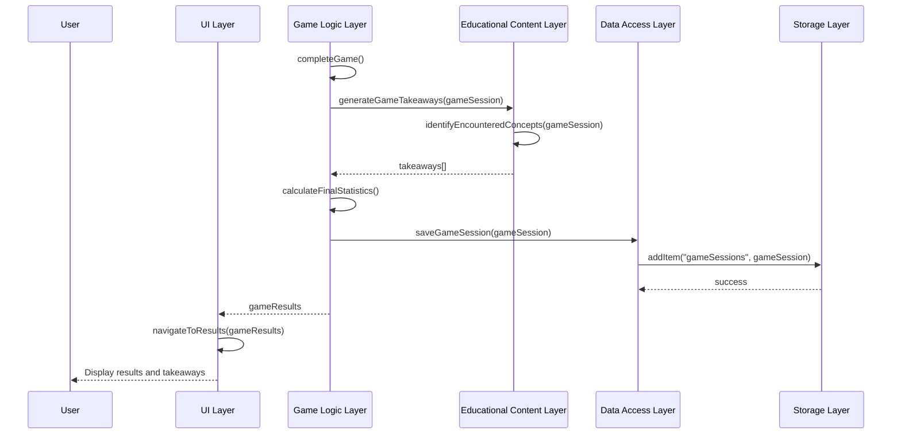
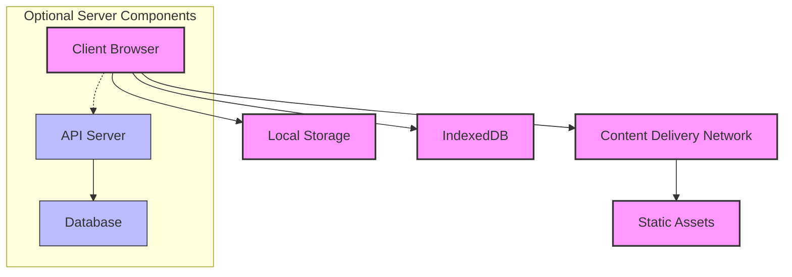
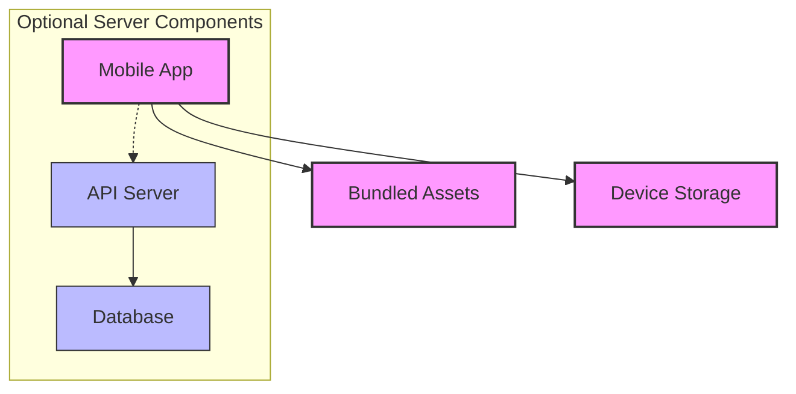

# Words Without Meaning: System Architecture

## 1. System Overview

"Words Without Meaning" is an educational game that demonstrates how words have no inherent meaning without context. The architecture must support the core educational objectives while providing an engaging, responsive user experience across multiple platforms.



## 2. Architectural Principles

1. **Separation of Concerns**: Clear boundaries between UI, game logic, educational content, and data management
2. **Modularity**: Components with well-defined interfaces that can be developed and tested independently
3. **Scalability**: Architecture that supports growth in content and user base
4. **Offline-First**: Core functionality available without internet connectivity
5. **Accessibility**: Design that accommodates users with different abilities
6. **Educational Focus**: Architecture decisions prioritize educational effectiveness

## 3. System Components

### 3.1 User Interface Layer

Responsible for presenting the game to users and handling interactions.

#### Components:
- **Screen Manager**: Controls navigation between different screens
- **UI Components**: Reusable interface elements (buttons, modals, etc.)
- **Animation Controller**: Manages transitions and visual feedback
- **Accessibility Manager**: Ensures interface is accessible to all users

#### Interfaces:
```typescript
interface IScreenManager {
  navigateTo(screen: ScreenType, params?: any): void;
  navigateBack(): void;
  getCurrentScreen(): ScreenType;
}

interface IUIComponent {
  render(): void;
  handleInteraction(event: InteractionEvent): void;
  updateState(newState: ComponentState): void;
}

interface IAnimationController {
  playAnimation(animationType: AnimationType, element: UIElement): Promise<void>;
  stopAnimation(element: UIElement): void;
}

interface IAccessibilityManager {
  enhanceAccessibility(component: UIComponent): void;
  getResponsiveLayout(screenWidth: number): ResponsiveLayout;
}
```

### 3.2 Game Logic Layer

Implements the core game mechanics and manages game state.

#### Components:
- **Game Session Manager**: Controls game initialization and progression
- **Round Manager**: Handles individual game rounds
- **Word Selection Service**: Selects appropriate words based on difficulty
- **Scoring Engine**: Calculates and tracks user scores
- **Timer Service**: Manages time limits for rounds

#### Interfaces:
```typescript
interface IGameSessionManager {
  initializeGame(settings: GameSettings): GameSession;
  getCurrentRound(): GameRound | null;
  startNextRound(): boolean;
  completeGame(): GameResults;
}

interface IRoundManager {
  createRound(word: Word, roundNumber: number): GameRound;
  processUserSelection(optionIndex: number): void;
  getContradictionData(): ContradictionData;
}

interface IWordSelectionService {
  selectWordsForGame(difficulty: DifficultyLevel, count: number): Word[];
  generateMeaningOptions(word: Word): MeaningOption[];
  selectContradictionMeaning(word: Word, options: MeaningOption[]): Meaning;
}

interface IScoringEngine {
  calculateScore(isCorrect: boolean, timeSpent: number, difficulty: DifficultyLevel): number;
  updateGameScore(gameSession: GameSession, roundScore: number): void;
}

interface ITimerService {
  startTimer(timeLimit: number): void;
  stopTimer(): number;
  getRemainingTime(): number;
  onTimeExpired: (callback: () => void) => void;
}
```

### 3.3 Educational Content Layer

Manages the educational aspects of the game.

#### Components:
- **Educational Message Service**: Provides contextual educational content
- **Concept Explanation Service**: Explains linguistic concepts
- **Learning Progression Tracker**: Tracks user's educational progress
- **Takeaway Generator**: Creates end-of-game educational takeaways

#### Interfaces:
```typescript
interface IEducationalMessageService {
  getEducationalMessage(word: Word, selectedMeaning: Meaning, contradictionMeaning: Meaning): EducationalMessage;
  getMessageForDifficulty(difficulty: DifficultyLevel): EducationalMessage[];
}

interface IConceptExplanationService {
  getConceptExplanation(concept: LinguisticConcept): ConceptExplanation;
  identifyConceptsForWord(word: Word): LinguisticConcept[];
}

interface ILearningProgressionTracker {
  recordConceptExposure(concept: LinguisticConcept): void;
  determineUserLearningStage(gameSession: GameSession): LearningStage;
  suggestNextConcepts(exposedConcepts: LinguisticConcept[]): LinguisticConcept[];
}

interface ITakeawayGenerator {
  generateGameTakeaways(gameSession: GameSession): EducationalTakeaway[];
  generatePerformanceFeedback(gameSession: GameSession): string;
}
```

### 3.4 Data Access Layer

Provides unified access to data across the application.

#### Components:
- **Word Repository**: Manages access to the word database
- **Game State Repository**: Handles saving and loading game state
- **User Settings Repository**: Manages user preferences
- **Educational Content Repository**: Provides access to educational content

#### Interfaces:
```typescript
interface IWordRepository {
  getWordsByDifficulty(difficulty: DifficultyLevel): Promise<Word[]>;
  getWordById(id: string): Promise<Word>;
  getDistractorsForWord(word: Word, count: number): Promise<Distractor[]>;
}

interface IGameStateRepository {
  saveGameSession(session: GameSession): Promise<void>;
  loadGameSession(id: string): Promise<GameSession>;
  getCompletedSessions(): Promise<GameSession[]>;
}

interface IUserSettingsRepository {
  getUserSettings(): UserSettings;
  updateUserSettings(settings: UserSettings): Promise<void>;
}

interface IEducationalContentRepository {
  getEducationalMessages(categories: string[]): Promise<EducationalMessage[]>;
  getLinguisticConcepts(): Promise<LinguisticConcept[]>;
}
```

### 3.5 Storage Layer

Handles persistent storage of data.

#### Components:
- **Local Storage Manager**: Manages browser local storage
- **IndexedDB Manager**: Handles more complex client-side storage
- **Sync Service**: Synchronizes data with server (if implemented)

#### Interfaces:
```typescript
interface ILocalStorageManager {
  setItem(key: string, value: any): void;
  getItem(key: string): any;
  removeItem(key: string): void;
}

interface IIndexedDBManager {
  initialize(): Promise<void>;
  addItem(storeName: string, item: any): Promise<string>;
  getItem(storeName: string, id: string): Promise<any>;
  queryItems(storeName: string, query: QueryParams): Promise<any[]>;
}

interface ISyncService {
  syncData(dataType: DataType): Promise<SyncResult>;
  isSyncRequired(dataType: DataType): boolean;
  getLastSyncTime(dataType: DataType): Date;
}
```

## 4. Data Flow

### 4.1 Game Initialization Flow



### 4.2 Game Round Flow



### 4.3 Game Completion Flow



## 5. Technology Recommendations

### 5.1 Frontend Framework

**Recommendation: React with TypeScript**

Rationale:
- Component-based architecture aligns with our modular design
- Strong typing with TypeScript improves code quality and maintainability
- Large ecosystem and community support
- Excellent performance for interactive applications
- Good support for accessibility features

Alternatives:
- Vue.js: Good alternative if team has more experience with Vue
- React Native: If native mobile apps are a priority

### 5.2 State Management

**Recommendation: Redux Toolkit with Redux Persist**

Rationale:
- Centralized state management simplifies data flow
- Redux Toolkit reduces boilerplate code
- Redux Persist enables offline functionality
- Time-travel debugging helps with complex state issues
- Strong TypeScript integration

Alternatives:
- Context API: For simpler state requirements
- MobX: If a more reactive approach is preferred

### 5.3 Styling

**Recommendation: Styled Components with Tailwind CSS**

Rationale:
- Component-scoped styling prevents conflicts
- Theme support for consistent design
- Tailwind provides utility classes for rapid development
- Good support for responsive design
- Excellent TypeScript integration

Alternatives:
- CSS Modules: For more traditional CSS approach
- Emotion: Similar to Styled Components with some different features

### 5.4 Storage

**Recommendation: IndexedDB with Dexie.js**

Rationale:
- Supports complex data structures needed for word database
- Efficient querying capabilities
- Handles large datasets well
- Dexie.js provides a cleaner API over raw IndexedDB
- Good offline support

Alternatives:
- LocalForage: Simpler API with multiple storage backends
- Firebase: If cloud synchronization is a priority

### 5.5 Build and Development

**Recommendation: Vite**

Rationale:
- Fast development server with hot module replacement
- Efficient production builds
- Built-in TypeScript support
- Simple configuration
- Good plugin ecosystem

Alternatives:
- Create React App: More established but slower
- Next.js: If server-side rendering becomes important

### 5.6 Testing

**Recommendation: Jest with React Testing Library**

Rationale:
- Comprehensive testing framework
- Good component testing capabilities
- Snapshot testing for UI components
- Mock capabilities for services
- Good TypeScript support

Alternatives:
- Vitest: Faster alternative designed for Vite
- Cypress: For more end-to-end testing needs

## 6. Scalability Considerations

### 6.1 Content Scalability

The architecture supports scaling the word database through:
- Lazy loading of word data based on difficulty level
- Efficient indexing in IndexedDB for fast queries
- Modular content structure allowing easy additions
- Separation of word data from game logic

### 6.2 User Base Scalability

For web deployment, the architecture supports scaling to many users through:
- Client-side processing reducing server requirements
- Efficient caching of static assets
- Minimal server dependencies (primarily for optional features)
- Progressive Web App capabilities for improved performance

### 6.3 Feature Scalability

The architecture supports adding new features through:
- Clear component interfaces allowing extensions
- Service-oriented design for adding new capabilities
- Event-based communication for loose coupling
- Modular UI components that can be composed in new ways

## 7. Maintainability Considerations

### 7.1 Code Organization

```
src/
├── components/           # UI components
│   ├── common/           # Reusable UI elements
│   ├── screens/          # Full-screen components
│   └── game/             # Game-specific components
├── services/             # Business logic services
│   ├── game/             # Game logic services
│   ├── education/        # Educational content services
│   └── storage/          # Data storage services
├── models/               # Data models and interfaces
├── store/                # State management
├── utils/                # Utility functions
├── assets/               # Static assets
│   ├── images/
│   ├── sounds/
│   └── data/             # Static data files
└── styles/               # Global styles and themes
```

### 7.2 Documentation Standards

- All interfaces should be documented with JSDoc comments
- Component props should include type definitions and descriptions
- Services should document their responsibilities and dependencies
- Data models should document field purposes and constraints
- README files should be maintained for each major directory

### 7.3 Testing Strategy

- Unit tests for all service functions
- Component tests for UI elements
- Integration tests for key user flows
- Accessibility tests for UI components
- Performance tests for data access operations

## 8. Security Considerations

### 8.1 Data Security

- No personally identifiable information collected by default
- User settings stored locally with appropriate encryption
- If user accounts are implemented:
  - Proper authentication and authorization
  - Secure password storage with hashing
  - Data minimization principles applied

### 8.2 Web Security

- Content Security Policy to prevent XSS attacks
- HTTPS for all communications if server components are added
- Input validation for all user-provided data
- Protection against common web vulnerabilities (OWASP Top 10)

### 8.3 Privacy Considerations

- Clear privacy policy explaining data usage
- User control over any data collection
- Compliance with relevant regulations (GDPR, CCPA)
- No third-party tracking without explicit consent

## 9. Deployment Architecture

### 9.1 Web Deployment



### 9.2 Mobile Deployment (if applicable)



## 10. Educational Objectives Support

The architecture supports the core educational objectives through:

1. **Context-Dependent Meaning**
   - Clear separation of words from their contextual meanings
   - Structured contradiction flow to highlight context importance
   - Educational content services integrated with gameplay

2. **Multiple Meanings Demonstration**
   - Data model supporting multiple meanings per word
   - Word selection service that identifies appropriate contradictions
   - UI components designed to highlight meaning differences

3. **Critical Thinking Encouragement**
   - Game flow designed to challenge assumptions
   - Educational messaging integrated at key learning moments
   - Feedback mechanisms that reinforce learning

4. **Engaging Experience**
   - Responsive UI architecture for smooth interactions
   - Animation and sound support for feedback
   - Difficulty progression to maintain challenge

## 11. Implementation Recommendations

### 11.1 Development Approach

1. **Phased Implementation**
   - Phase 1: Core data structures and basic game loop
   - Phase 2: Complete UI and educational content
   - Phase 3: Polish, optimization, and additional features

2. **Prioritization**
   - Implement the word database and game logic first
   - Focus on the contradiction reveal as the key educational moment
   - Ensure accessibility is built in from the beginning

3. **Testing Focus**
   - Test educational effectiveness with target audience
   - Ensure performance on lower-end devices
   - Validate accessibility with diverse users

### 11.2 Key Implementation Challenges

1. **Word Database Quality**
   - Ensure words have genuinely different meanings
   - Create clear, effective contradiction sentences
   - Balance difficulty levels appropriately

2. **Educational Content Integration**
   - Seamlessly integrate educational messages into gameplay
   - Make learning moments impactful without disrupting flow
   - Balance educational content with engagement

3. **Offline Functionality**
   - Ensure complete functionality without internet
   - Manage database size for efficient storage
   - Handle state persistence correctly

## 12. Conclusion

This architecture provides a solid foundation for implementing the "Words Without Meaning" game. It emphasizes:

- Clear separation of concerns for maintainability
- Modular design for extensibility
- Educational effectiveness as a primary goal
- Performance and accessibility as key requirements
- Scalability for future growth

The recommended technologies and approaches balance modern development practices with the specific needs of an educational game. By following this architecture, the development team can create a game that effectively demonstrates how words derive meaning from context while providing an engaging and accessible user experience.