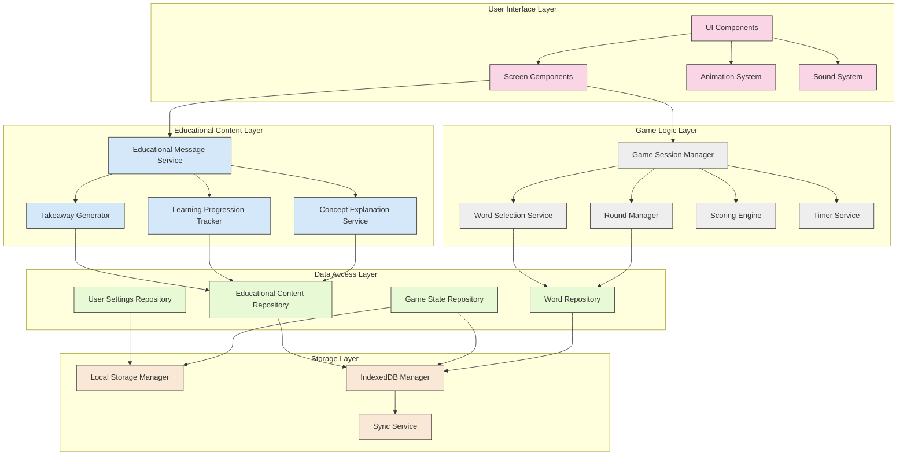
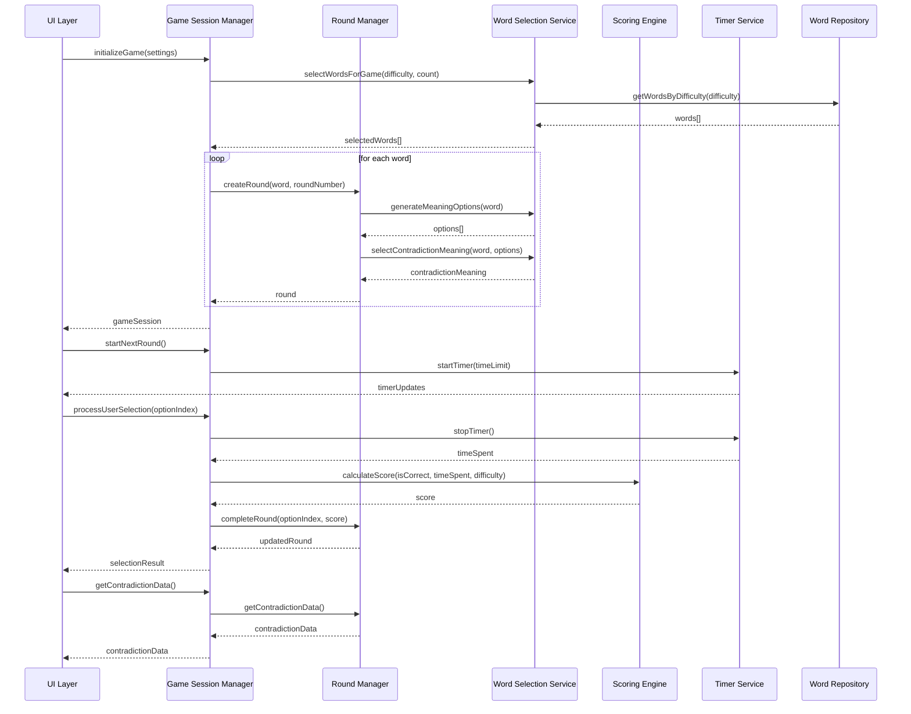
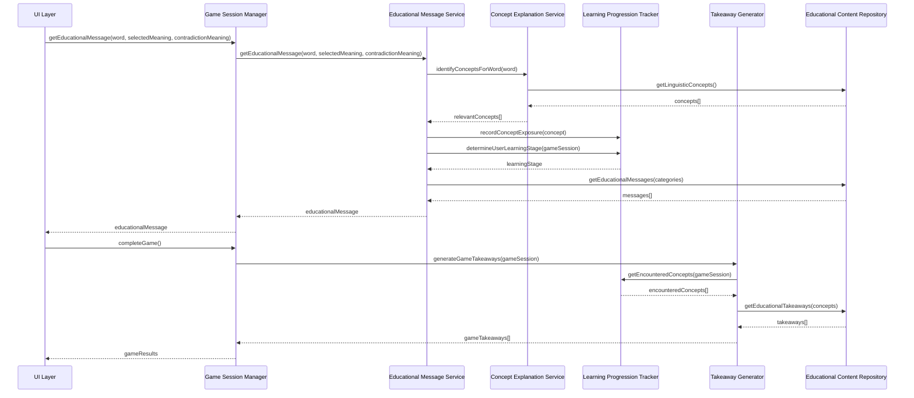
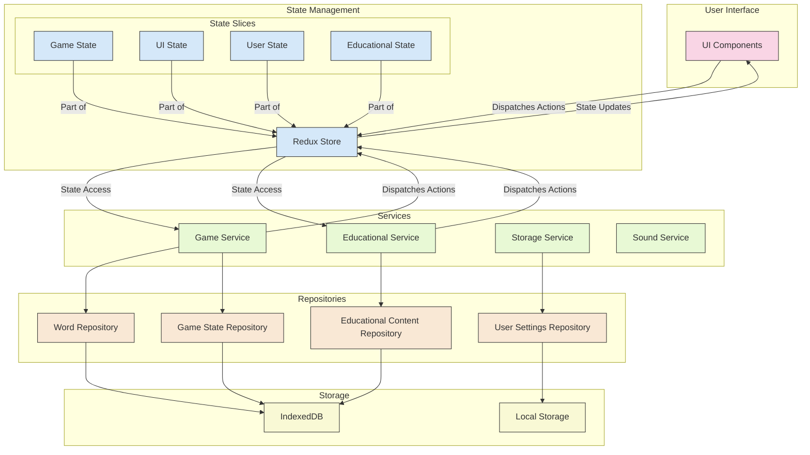

# Words Without Meaning: Component Diagram

This document provides detailed component diagrams for the "Words Without Meaning" game, illustrating the structure and relationships between components in the system.

## 1. Overall Component Architecture

The following diagram shows the high-level component architecture of the system:

## 2. UI Component Hierarchy

The following diagram shows the hierarchy of UI components:

```mermaid
graph TD
    App[App] --> Router[Router]
    Router --> LaunchScreen[Launch Screen]
    Router --> HowToPlayScreen[How To Play Screen]
    Router --> SettingsScreen[Settings Screen]
    Router --> GameSetupScreen[Game Setup Screen]
    Router --> GameplayScreen[Gameplay Screen]
    Router --> ResultsScreen[Results Screen]
    Router --> AboutScreen[About Screen]
    
    LaunchScreen --> Header1[Header]
    LaunchScreen --> Logo[Logo]
    LaunchScreen --> StartButton[Start Button]
    LaunchScreen --> HowToPlayButton[How To Play Button]
    LaunchScreen --> SettingsButton[Settings Button]
    LaunchScreen --> AboutButton[About Button]
    
    HowToPlayScreen --> Header2[Header]
    HowToPlayScreen --> InstructionList[Instruction List]
    HowToPlayScreen --> ExampleCard[Example Card]
    HowToPlayScreen --> BackButton1[Back Button]
    
    SettingsScreen --> Header3[Header]
    SettingsScreen --> DifficultySelector[Difficulty Selector]
    SettingsScreen --> RoundCountSelector[Round Count Selector]
    SettingsScreen --> TimeLimitSelector[Time Limit Selector]
    SettingsScreen --> SoundToggle[Sound Toggle]
    SettingsScreen --> SaveButton[Save Button]
    SettingsScreen --> CancelButton[Cancel Button]
    
    GameSetupScreen --> Header4[Header]
    GameSetupScreen --> SettingsSummary[Settings Summary]
    GameSetupScreen --> StartGameButton[Start Game Button]
    GameSetupScreen --> ChangeSettingsButton[Change Settings Button]
    
    GameplayScreen --> Header5[Header]
    GameplayScreen --> ProgressBar[Progress Bar]
    GameplayScreen --> ScoreDisplay[Score Display]
    GameplayScreen --> WordDisplay[Word Display]
    GameplayScreen --> TimerDisplay[Timer Display]
    GameplayScreen --> OptionsContainer[Options Container]
    GameplayScreen --> ContradictionDisplay[Contradiction Display]
    GameplayScreen --> EducationalMessageDisplay[Educational Message Display]
    GameplayScreen --> NextWordButton[Next Word Button]
    
    OptionsContainer --> OptionButton1[Option Button 1]
    OptionsContainer --> OptionButton2[Option Button 2]
    OptionsContainer --> OptionButton3[Option Button 3]
    OptionsContainer --> OptionButton4[Option Button 4]
    
    ContradictionDisplay --> UserSelectionDisplay[User Selection Display]
    ContradictionDisplay --> ContradictionSentence[Contradiction Sentence]
    ContradictionDisplay --> ExplanationText[Explanation Text]
    
    ResultsScreen --> Header6[Header]
    ResultsScreen --> ResultsCard[Results Card]
    ResultsScreen --> TakeawaysSection[Takeaways Section]
    ResultsScreen --> PlayAgainButton[Play Again Button]
    ResultsScreen --> MainMenuButton[Main Menu Button]
    
    ResultsCard --> FinalScore[Final Score]
    ResultsCard --> PerformanceText[Performance Text]
    ResultsCard --> StatisticsSection[Statistics Section]
    
    TakeawaysSection --> TakeawayItem1[Takeaway Item 1]
    TakeawaysSection --> TakeawayItem2[Takeaway Item 2]
    TakeawaysSection --> TakeawayItem3[Takeaway Item 3]
    
    AboutScreen --> Header7[Header]
    AboutScreen --> AboutContent[About Content]
    AboutScreen --> BackButton2[Back Button]
    
    classDef screen fill:#f9d5e5,stroke:#333,stroke-width:1px;
    classDef container fill:#d5e8f9,stroke:#333,stroke-width:1px;
    classDef component fill:#e8f9d5,stroke:#333,stroke-width:1px;
    
    class App,Router component;
    class LaunchScreen,HowToPlayScreen,SettingsScreen,GameSetupScreen,GameplayScreen,ResultsScreen,AboutScreen screen;
    class OptionsContainer,ContradictionDisplay,ResultsCard,TakeawaysSection,StatisticsSection container;
```

## 3. Game Logic Component Interactions

The following diagram shows the interactions between game logic components:

## 4. Educational Content Component Interactions

The following diagram shows the interactions between educational content components:

## 5. Data Flow Component Diagram

The following diagram shows the data flow between components:

## 6. Component Responsibilities

### 6.1 UI Components

| Component | Responsibility |
|-----------|----------------|
| **App** | Root component that initializes the application |
| **Router** | Manages navigation between screens |
| **LaunchScreen** | Displays the initial screen with game options |
| **HowToPlayScreen** | Explains game rules and concepts |
| **SettingsScreen** | Allows users to configure game settings |
| **GameSetupScreen** | Prepares for a new game session |
| **GameplayScreen** | Manages the core gameplay experience |
| **ResultsScreen** | Shows game results and educational takeaways |
| **AboutScreen** | Provides information about the game |
| **WordDisplay** | Displays the current word |
| **OptionButton** | Displays a meaning option and handles selection |
| **ContradictionDisplay** | Shows the contradiction sentence and explanation |
| **EducationalMessageDisplay** | Presents educational content |
| **ProgressBar** | Shows progress through game rounds |
| **TimerDisplay** | Displays remaining time for current round |

### 6.2 Game Logic Components

| Component | Responsibility |
|-----------|----------------|
| **GameSessionManager** | Controls overall game flow and state |
| **RoundManager** | Manages individual game rounds |
| **WordSelectionService** | Selects appropriate words and meanings |
| **ScoringEngine** | Calculates scores based on performance |
| **TimerService** | Manages time limits for rounds |

### 6.3 Educational Content Components

| Component | Responsibility |
|-----------|----------------|
| **EducationalMessageService** | Provides contextual educational content |
| **ConceptExplanationService** | Explains linguistic concepts |
| **LearningProgressionTracker** | Tracks user's educational progress |
| **TakeawayGenerator** | Creates end-of-game educational takeaways |

### 6.4 Data Access Components

| Component | Responsibility |
|-----------|----------------|
| **WordRepository** | Manages access to the word database |
| **GameStateRepository** | Handles saving and loading game state |
| **UserSettingsRepository** | Manages user preferences |
| **EducationalContentRepository** | Provides access to educational content |

### 6.5 Storage Components

| Component | Responsibility |
|-----------|----------------|
| **LocalStorageManager** | Manages browser local storage |
| **IndexedDBManager** | Handles more complex client-side storage |
| **SyncService** | Synchronizes data with server (if implemented) |

## 7. Component Dependencies

The following table shows the dependencies between major components:

| Component | Dependencies |
|-----------|--------------|
| **GameplayScreen** | GameSessionManager, EducationalMessageService, TimerService |
| **GameSessionManager** | RoundManager, WordSelectionService, ScoringEngine, GameStateRepository |
| **RoundManager** | WordRepository, WordSelectionService |
| **EducationalMessageService** | ConceptExplanationService, LearningProgressionTracker, EducationalContentRepository |
| **TakeawayGenerator** | LearningProgressionTracker, EducationalContentRepository |
| **WordRepository** | IndexedDBManager |
| **GameStateRepository** | IndexedDBManager, LocalStorageManager |
| **UserSettingsRepository** | LocalStorageManager |

## 8. Component Communication Patterns

### 8.1 UI to Logic Communication

1. **Action Dispatching**: UI components dispatch actions to the Redux store
2. **Prop Passing**: Parent components pass data and callbacks to children
3. **Context Providers**: Global state accessible to component trees

### 8.2 Logic to Data Communication

1. **Repository Pattern**: Logic components access data through repository interfaces
2. **Async/Await**: Asynchronous data operations with clean syntax
3. **Promises**: For handling asynchronous operations

### 8.3 Cross-Component Communication

1. **Event Bus**: For loosely coupled component communication
2. **Redux Middleware**: For side effects and complex operations
3. **Service Locator**: For accessing shared services

## 9. Component Implementation Guidelines

### 9.1 UI Components

- Implement as functional components with hooks
- Use React.memo for performance optimization
- Keep components focused on a single responsibility
- Separate presentation from logic with container/presentational pattern

### 9.2 Service Components

- Implement as singleton classes or factory functions
- Use dependency injection for testability
- Provide clear interfaces for all public methods
- Handle errors gracefully with appropriate fallbacks

### 9.3 Repository Components

- Abstract storage details from business logic
- Implement caching strategies for performance
- Handle offline scenarios gracefully
- Provide consistent error handling

## 10. Component Testing Strategy

### 10.1 UI Component Testing

- Unit tests for individual components
- Snapshot tests for UI appearance
- Interaction tests for user actions
- Accessibility tests for all components

### 10.2 Service Component Testing

- Unit tests for business logic
- Integration tests for service interactions
- Mock dependencies for isolation
- Test error handling and edge cases

### 10.3 Repository Component Testing

- Unit tests with mocked storage
- Integration tests with test database
- Performance tests for data operations
- Test offline and error scenarios