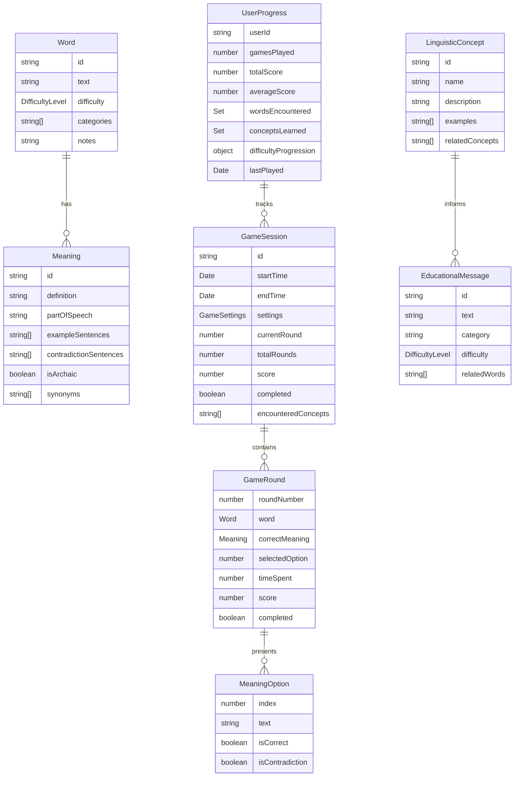

# Words Without Meaning: Data Models

This document provides detailed specifications for the data models used in the "Words Without Meaning" game. These models define the structure of data throughout the system and serve as the foundation for both the game logic and educational content.

## 1. Core Data Models

### 1.1 Word Model

The fundamental unit of the game, representing a word with multiple meanings.

```typescript
interface Word {
  id: string;                 // Unique identifier
  text: string;               // The word itself
  difficulty: DifficultyLevel; // Easy, Medium, or Hard
  categories: string[];       // Linguistic categories (e.g., "noun", "verb", "homonym")
  meanings: Meaning[];        // Array of different meanings for this word
  notes: string;              // Optional linguistic notes about the word
}

enum DifficultyLevel {
  EASY = "easy",
  MEDIUM = "medium",
  HARD = "hard"
}
```

### 1.2 Meaning Model

Represents a specific meaning or definition of a word.

```typescript
interface Meaning {
  id: string;                // Unique identifier
  definition: string;        // Clear, concise definition
  partOfSpeech: string;      // Noun, verb, adjective, etc.
  exampleSentences: string[]; // Sentences using the word with this meaning
  contradictionSentences: string[]; // Sentences designed to contradict other meanings
  isArchaic: boolean;        // Flag for archaic or uncommon usages
  synonyms: string[];        // Words with similar meanings
}
```

### 1.3 Distractor Model

Represents plausible but incorrect meanings used as distractors in the game.

```typescript
interface Distractor {
  id: string;               // Unique identifier
  definition: string;       // Plausible but incorrect definition
  forWordTypes: string[];   // Types of words this distractor works well with
  difficulty: DifficultyLevel; // Indicates how challenging this distractor is
}
```

## 2. Game State Models

### 2.1 Game Session Model

Represents an active game being played by a user.

```typescript
interface GameSession {
  id: string;                // Unique identifier
  startTime: Date;           // When the game session began
  endTime: Date | null;      // When the game session ended (null if in progress)
  settings: GameSettings;    // User-selected game settings
  currentRound: number;      // Current round number (1-based)
  totalRounds: number;       // Total number of rounds in this session
  score: number;             // Current cumulative score
  rounds: GameRound[];       // Array of round data
  completed: boolean;        // Whether the game session is complete
  encounteredConcepts: string[]; // Linguistic concepts encountered during play
}

interface GameSettings {
  difficulty: DifficultyLevel;
  roundCount: 5 | 10 | 15;   // Number of rounds per game
  timeLimit: number;         // Seconds per word (0 for no limit)
  soundEnabled: boolean;     // Whether sound effects are enabled
}
```

### 2.2 Game Round Model

Represents a single round within a game session.

```typescript
interface GameRound {
  roundNumber: number;       // 1-based round number
  word: Word;                // The word being presented
  correctMeaning: Meaning;   // The meaning used for the contradiction
  options: MeaningOption[];  // Array of 4 options presented to the user
  selectedOption: number | null; // Index of user's selection (null if not yet selected)
  timeSpent: number;         // Seconds spent on this round
  score: number;             // Score for this specific round
  completed: boolean;        // Whether this round is complete
}

interface MeaningOption {
  index: number;             // Position in the options array (0-3)
  text: string;              // The definition text shown to the user
  isCorrect: boolean;        // Whether this is a correct meaning for the word
  isContradiction: boolean;  // Whether this is the meaning used in the contradiction
}
```

### 2.3 Game Results Model

Represents the results of a completed game session.

```typescript
interface GameResults {
  score: number;             // Final score
  totalRounds: number;       // Number of rounds played
  correctAnswers: number;    // Number of correct answers
  accuracyRate: number;      // Percentage of correct answers
  averageTimePerRound: number; // Average time spent per round
  difficulty: DifficultyLevel; // Difficulty level played
  performance: string;       // Textual assessment of performance
  educationalTakeaways: string[]; // Educational takeaways from the game
  suggestion: string;        // Suggestion for next steps
}
```

## 3. Educational Content Models

### 3.1 Educational Message Model

Represents educational content displayed during gameplay.

```typescript
interface EducationalMessage {
  id: string;                // Unique identifier
  text: string;              // The educational message text
  category: string;          // Category of linguistic concept
  difficulty: DifficultyLevel; // Complexity level of the concept
  relatedWords: string[];    // Words that particularly demonstrate this concept
}
```

### 3.2 Linguistic Concept Model

Represents a linguistic concept taught through the game.

```typescript
interface LinguisticConcept {
  id: string;                // Unique identifier
  name: string;              // Name of the linguistic concept
  description: string;       // Explanation of the concept
  examples: string[];        // Examples demonstrating the concept
  relatedConcepts: string[]; // IDs of related linguistic concepts
}
```

### 3.3 Educational Takeaway Model

Represents a key learning point presented at the end of a game.

```typescript
interface EducationalTakeaway {
  id: string;                // Unique identifier
  text: string;              // The takeaway message
  conceptId: string;         // Related linguistic concept
  difficulty: DifficultyLevel; // Complexity level of the takeaway
}
```

## 4. User Data Models

### 4.1 User Settings Model

Represents user preferences for the game.

```typescript
interface UserSettings {
  defaultDifficulty: DifficultyLevel;
  defaultRoundCount: 5 | 10 | 15;
  defaultTimeLimit: number;
  soundEnabled: boolean;
  theme: string;             // UI theme preference
  accessibility: AccessibilitySettings;
}

interface AccessibilitySettings {
  highContrast: boolean;
  largeText: boolean;
  reducedMotion: boolean;
  screenReaderOptimized: boolean;
}
```

### 4.2 User Progress Model

Tracks a user's progress and performance over time (for optional user account feature).

```typescript
interface UserProgress {
  userId: string;            // User identifier
  gamesPlayed: number;       // Total games played
  totalScore: number;        // Cumulative score across all games
  averageScore: number;      // Average score per game
  wordsEncountered: Set<string>; // Words the user has seen
  conceptsLearned: Set<string>; // Linguistic concepts encountered
  difficultyProgression: {   // Progress at each difficulty level
    easy: number,
    medium: number,
    hard: number
  };
  lastPlayed: Date;          // When the user last played
}
```

## 5. UI State Models

### 5.1 Application State Model

Represents the overall state of the application.

```typescript
interface AppState {
  currentScreen: ScreenType;
  gameSession: GameSession | null;
  userSettings: UserSettings;
  uiState: UIState;
  isLoading: boolean;
  error: ErrorState | null;
}

enum ScreenType {
  LAUNCH = "launch",
  HOW_TO_PLAY = "howToPlay",
  SETTINGS = "settings",
  GAME_SETUP = "gameSetup",
  GAMEPLAY = "gameplay",
  RESULTS = "results",
  ABOUT = "about"
}

interface UIState {
  theme: ThemeType;
  animations: boolean;
  soundEffects: boolean;
  modalOpen: boolean;
  modalContent: any;
}

interface ErrorState {
  message: string;
  code: string;
  recoverable: boolean;
}
```

### 5.2 Gameplay UI State Model

Represents the UI state during active gameplay.

```typescript
interface GameplayUIState {
  showingContradiction: boolean;
  contradictionData: ContradictionData | null;
  timeRemaining: number;
  animationState: AnimationState;
  selectedOptionIndex: number | null;
  educationalMessage: string | null;
}

interface ContradictionData {
  sentence: string;
  highlightedSentence: string;
  meaning: string;
  explanation: string;
}

enum AnimationState {
  IDLE = "idle",
  SELECTING = "selecting",
  REVEALING = "revealing",
  TRANSITIONING = "transitioning"
}
```

## 6. Data Relationships

The following diagram illustrates the relationships between the core data models:



## 7. Data Storage Strategy

### 7.1 Local Storage Items

Simple key-value pairs stored in browser localStorage:

| Key | Value Type | Purpose |
|-----|------------|---------|
| `userSettings` | `UserSettings` | Store user preferences |
| `currentGameId` | `string` | ID of in-progress game |
| `lastPlayedDate` | `Date` | When the user last played |
| `hasSeenTutorial` | `boolean` | Whether user has seen tutorial |
| `soundEnabled` | `boolean` | Global sound setting |

### 7.2 IndexedDB Stores

More complex data stored in IndexedDB:

| Store Name | Key | Indexes | Purpose |
|------------|-----|---------|---------|
| `words` | `id` | `difficulty`, `text` | Word database |
| `meanings` | `id` | `wordId` | Word meanings |
| `distractors` | `id` | `difficulty`, `forWordTypes` | Distractor definitions |
| `gameSessions` | `id` | `completed`, `startTime` | Game session data |
| `gameRounds` | `id` | `gameSessionId`, `roundNumber` | Round data |
| `educationalMessages` | `id` | `category`, `difficulty` | Educational content |
| `linguisticConcepts` | `id` | `name` | Linguistic concepts |
| `userProgress` | `userId` | none | User progress data |

### 7.3 Data Loading Strategy

1. **Initial Load**:
   - Load essential UI assets and code
   - Load user settings from localStorage
   - Initialize IndexedDB structure

2. **Word Database Loading**:
   - Load word metadata (without full details) for selected difficulty
   - Load full word details on demand during gameplay
   - Preload next word while user is viewing current word

3. **Game State Persistence**:
   - Save game state after each significant action
   - Restore in-progress game on application restart
   - Archive completed games for history/statistics

## 8. Sample Data

### 8.1 Sample Word Data

```json
{
  "id": "word_001",
  "text": "bank",
  "difficulty": "medium",
  "categories": ["noun", "verb", "homonym"],
  "meanings": [
    {
      "id": "meaning_001",
      "definition": "A financial institution that accepts deposits and channels those deposits into lending activities",
      "partOfSpeech": "noun",
      "exampleSentences": [
        "I need to go to the bank to deposit my paycheck."
      ],
      "contradictionSentences": [
        "After the heavy rain, the river bank was eroded significantly."
      ],
      "isArchaic": false,
      "synonyms": ["financial institution", "credit union"]
    },
    {
      "id": "meaning_002",
      "definition": "The land alongside or sloping down to a river or lake",
      "partOfSpeech": "noun",
      "exampleSentences": [
        "We had a picnic on the grassy bank by the river."
      ],
      "contradictionSentences": [
        "The bank approved her loan application within a week."
      ],
      "isArchaic": false,
      "synonyms": ["shore", "riverside", "embankment"]
    },
    {
      "id": "meaning_003",
      "definition": "To tilt or incline an aircraft in a turn",
      "partOfSpeech": "verb",
      "exampleSentences": [
        "The pilot had to bank the plane sharply to avoid the storm."
      ],
      "contradictionSentences": [
        "I bank with a local credit union rather than a national chain."
      ],
      "isArchaic": false,
      "synonyms": ["tilt", "incline", "angle"]
    }
  ],
  "notes": "Classic example of a homonym with etymologically distinct meanings"
}
```

### 8.2 Sample Game Round Data

```json
{
  "roundNumber": 3,
  "word": {
    "id": "word_001",
    "text": "bank",
    "difficulty": "medium",
    "categories": ["noun", "verb", "homonym"]
  },
  "correctMeaning": {
    "id": "meaning_002",
    "definition": "The land alongside or sloping down to a river or lake",
    "partOfSpeech": "noun"
  },
  "options": [
    {
      "index": 0,
      "text": "A financial institution that accepts deposits",
      "isCorrect": true,
      "isContradiction": false
    },
    {
      "index": 1,
      "text": "The land alongside or sloping down to a river or lake",
      "isCorrect": true,
      "isContradiction": true
    },
    {
      "index": 2,
      "text": "A collection or store of something available for use",
      "isCorrect": true,
      "isContradiction": false
    },
    {
      "index": 3,
      "text": "To prepare food by heating it in an oven",
      "isCorrect": false,
      "isContradiction": false
    }
  ],
  "selectedOption": 0,
  "timeSpent": 12.5,
  "score": 75,
  "completed": true
}
```

### 8.3 Sample Educational Message

```json
{
  "id": "edu_msg_001",
  "text": "Words like 'bank' are called homonyms - they have the same spelling and pronunciation but completely different meanings depending on context.",
  "category": "homonym",
  "difficulty": "easy",
  "relatedWords": ["bank", "bat", "bear", "fair", "kind"]
}
```

## 9. Data Validation Rules

### 9.1 Word Validation

- `text` must be non-empty and contain only valid characters
- `difficulty` must be one of the defined DifficultyLevel values
- `categories` must contain at least one category
- `meanings` must contain at least 2 distinct meanings

### 9.2 Meaning Validation

- `definition` must be non-empty and under 200 characters
- `partOfSpeech` must be a valid part of speech
- `exampleSentences` must contain at least one sentence
- `contradictionSentences` must contain at least one sentence
- Sentences must contain the word they're exemplifying

### 9.3 Game Session Validation

- `settings` must contain valid values for all fields
- `currentRound` must be between 1 and `totalRounds`
- `score` must be non-negative
- `rounds` length must match `currentRound` for in-progress games

## 10. Data Migration Strategy

For future updates to the data models:

1. **Version Tracking**:
   - Store schema version in metadata
   - Check version on application start

2. **Migration Functions**:
   - Define migration functions for each version upgrade
   - Apply migrations sequentially

3. **Fallback Strategy**:
   - Provide option to reset data if migration fails
   - Ensure critical game functionality works with default data

Example migration function:

```typescript
function migrateFromV1ToV2(db: IDBDatabase): Promise<void> {
  return new Promise((resolve, reject) => {
    // Add new object store for educational takeaways
    if (!db.objectStoreNames.contains('educationalTakeaways')) {
      db.createObjectStore('educationalTakeaways', { keyPath: 'id' });
    }
    
    // Update existing words to add new fields
    const transaction = db.transaction(['words'], 'readwrite');
    const wordStore = transaction.objectStore('words');
    
    const request = wordStore.openCursor();
    request.onerror = () => reject(new Error('Failed to open cursor'));
    
    request.onsuccess = (event) => {
      const cursor = (event.target as IDBRequest).result;
      if (cursor) {
        const word = cursor.value;
        // Add new field
        if (!word.hasOwnProperty('notes')) {
          word.notes = '';
        }
        cursor.update(word);
        cursor.continue();
      } else {
        resolve();
      }
    };
  });
}