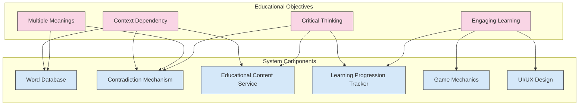
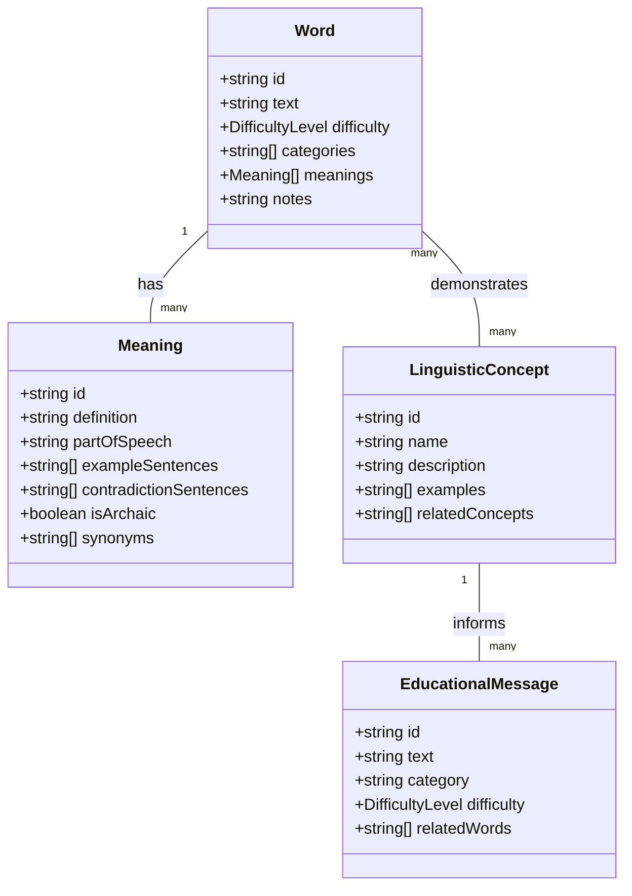
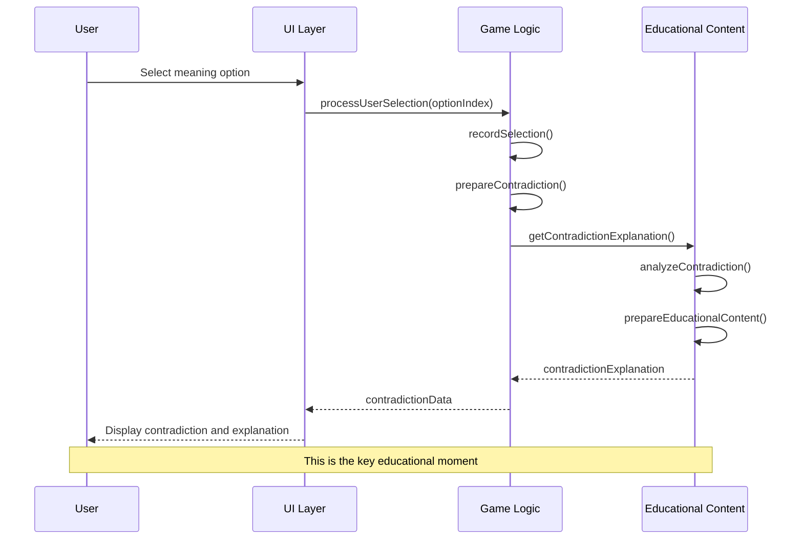
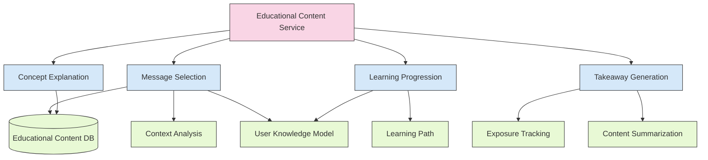
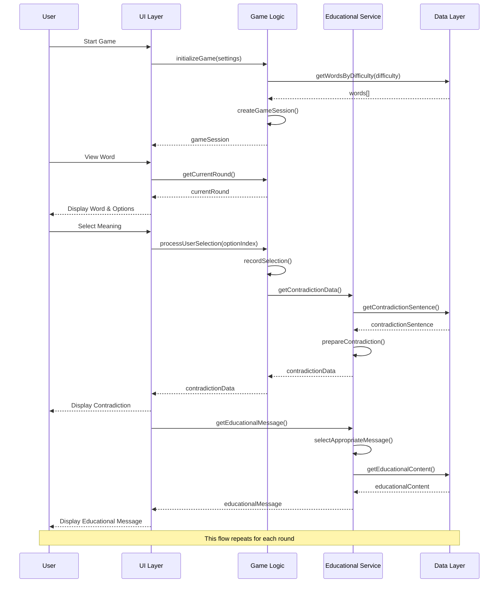
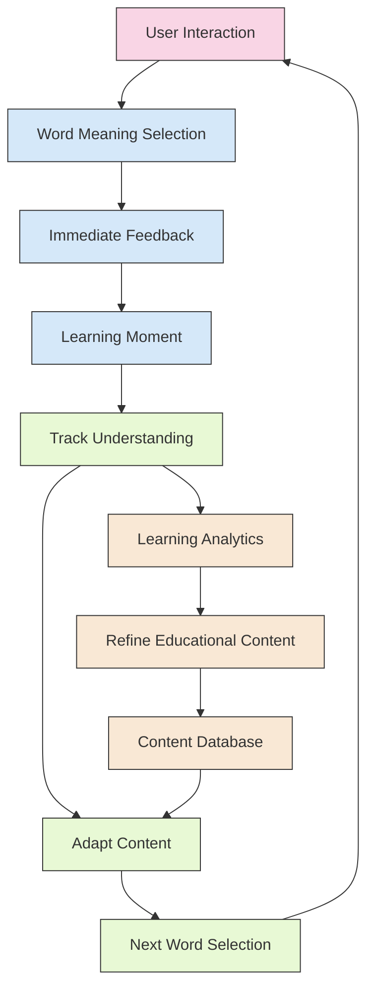

# Words Without Meaning: Educational Architecture

This document outlines how the system architecture supports the educational objectives of the "Words Without Meaning" game. It details the specific components, data flows, and design decisions that enable effective learning about contextual meaning in language.

## 1. Educational Objectives Integration

### 1.1 Core Educational Objectives

The architecture is designed to support these primary educational objectives:

1. **Demonstrate Context Dependency**: Show that words have no inherent meaning without context
2. **Illustrate Multiple Meanings**: Highlight how the same word can have contradictory meanings
3. **Encourage Critical Thinking**: Promote analysis of language and communication
4. **Provide Engaging Learning**: Deliver linguistic concepts through interactive gameplay

### 1.2 Educational Objectives Mapping

The following diagram maps educational objectives to system components:



## 2. Educational Components Architecture

### 2.1 Word Database Educational Design

The Word Database is structured to support educational objectives:



#### 2.1.1 Educational Word Selection Criteria

Words in the database are selected based on these educational criteria:

1. **Multiple Distinct Meanings**: Each word must have at least two clearly distinct meanings
2. **Contradiction Potential**: Meanings should create clear contradictions when used in different contexts
3. **Concept Illustration**: Words should illustrate important linguistic concepts
4. **Appropriate Difficulty**: Words are categorized by difficulty level for progressive learning
5. **Common Usage**: Words should be commonly used to ensure relevance

#### 2.1.2 Educational Metadata

Each word includes educational metadata:

```javascript
// Example word with educational metadata
const wordWithEducationalMetadata = {
  id: "word_001",
  text: "bank",
  difficulty: "medium",
  categories: ["noun", "verb", "homonym"],
  meanings: [
    // Meanings array
  ],
  notes: "Classic example of a homonym with etymologically distinct meanings",
  linguisticConcepts: ["homonymy", "context_dependency"],
  learningObjectives: [
    "Recognize homonyms in everyday language",
    "Understand how context determines which meaning is intended"
  ]
};
```

### 2.2 Contradiction Mechanism

The Contradiction Mechanism is central to the educational experience:



#### 2.2.1 Educational Design of Contradictions

Contradictions are designed to maximize educational impact:

1. **Clear Contrast**: Contradiction sentences clearly demonstrate a different meaning
2. **Natural Usage**: Sentences use the word in natural, common contexts
3. **Cognitive Dissonance**: Creates a moment of surprise that enhances learning
4. **Immediate Feedback**: Provides explanation immediately after selection

#### 2.2.2 Contradiction Data Structure

```javascript
// Educational contradiction structure
interface ContradictionData {
  // Original context
  selectedMeaning: {
    text: string;
    partOfSpeech: string;
    isCorrect: boolean;
  };
  
  // Contradictory context
  contradiction: {
    sentence: string;
    highlightedSentence: string; // With HTML highlighting
    meaning: string;
    partOfSpeech: string;
  };
  
  // Educational content
  explanation: {
    linguisticPhenomenon: string;
    explanationText: string;
    conceptName: string;
    conceptDefinition: string;
  };
  
  // Learning reinforcement
  takeaway: string;
}
```

### 2.3 Educational Content Service

The Educational Content Service manages the pedagogical aspects:



#### 2.3.1 Educational Message Selection

Messages are selected based on multiple factors:

```javascript
// Educational message selection algorithm
function selectEducationalMessage(context) {
  // Analyze the contradiction context
  const linguisticConcept = identifyLinguisticConcept(
    context.word,
    context.selectedMeaning,
    context.contradictionMeaning
  );
  
  // Consider user's learning progression
  const userKnowledge = getUserKnowledgeLevel(linguisticConcept);
  
  // Determine appropriate difficulty
  const messageDifficulty = determineMessageDifficulty(
    context.gameDifficulty,
    userKnowledge
  );
  
  // Get relevant messages
  const relevantMessages = getEducationalMessages({
    concept: linguisticConcept,
    difficulty: messageDifficulty,
    wordCategories: context.word.categories
  });
  
  // Select most appropriate message
  return selectBestMessage(relevantMessages, context);
}
```

#### 2.3.2 Learning Progression Tracking

The system tracks learning progression to adapt content:

```javascript
// Learning progression tracking
class LearningProgressionTracker {
  // Track concept exposure
  recordConceptExposure(userId, concept, exposureType) {
    const userProgress = this.getUserProgress(userId);
    
    if (!userProgress.conceptExposures[concept]) {
      userProgress.conceptExposures[concept] = [];
    }
    
    userProgress.conceptExposures[concept].push({
      timestamp: Date.now(),
      exposureType: exposureType, // 'introduction', 'reinforcement', 'application'
      count: userProgress.conceptExposures[concept].length + 1
    });
    
    this.updateUserProgress(userId, userProgress);
  }
  
  // Determine current learning stage
  determineUserLearningStage(userId, concept) {
    const userProgress = this.getUserProgress(userId);
    const exposures = userProgress.conceptExposures[concept] || [];
    
    if (exposures.length === 0) {
      return 'introduction';
    } else if (exposures.length < 3) {
      return 'reinforcement';
    } else {
      return 'application';
    }
  }
}
```

## 3. Educational Data Flows

### 3.1 Core Educational Flow

The primary educational flow through the system:



### 3.2 Learning Progression Flow

How the system adapts to user learning:

```mermaid
graph TD
    Start[Start Game] --> FirstRound[First Round]
    FirstRound --> Intro[Introduce Basic Concept]
    Intro --> UserSelect[User Selects Meaning]
    UserSelect --> Contra[Show Contradiction]
    Contra --> Explain[Explain Concept]
    Explain --> Track[Track Concept Exposure]
    Track --> NextRound[Next Round]
    
    NextRound --> Check{Check Learning Progress}
    Check -->|New Concept| Introduce[Introduce New Concept]
    Check -->|Reinforce| Reinforce[Reinforce Previous Concept]
    Check -->|Apply| Apply[Apply Concept in New Context]
    
    Introduce --> UserSelect2[User Selects Meaning]
    Reinforce --> UserSelect2
    Apply --> UserSelect2
    
    UserSelect2 --> Repeat[Repeat Process]
    Repeat --> Complete[Complete Game]
    Complete --> Analyze[Analyze Learning]
    Analyze --> Summary[Generate Learning Summary]
    
    classDef start fill:#f9d5e5,stroke:#333,stroke-width:1px;
    classDef process fill:#d5e8f9,stroke:#333,stroke-width:1px;
    classDef decision fill:#e8f9d5,stroke:#333,stroke-width:1px;
    classDef end fill:#f9e8d5,stroke:#333,stroke-width:1px;
    
    class Start,FirstRound start;
    class Intro,UserSelect,Contra,Explain,Track,NextRound,UserSelect2,Repeat process;
    class Check decision;
    class Complete,Analyze,Summary end;
```

## 4. Educational Effectiveness Design

### 4.1 Pedagogical Approach Implementation

The architecture implements these pedagogical approaches:

#### 4.1.1 Experiential Learning

```javascript
// Experiential learning implementation
class ExperientialLearningService {
  // Create a learning experience around a contradiction
  createLearningExperience(word, selectedMeaning, contradictionMeaning) {
    // 1. Concrete Experience - User selects a meaning
    const concreteExperience = {
      word: word.text,
      selectedMeaning: selectedMeaning.definition
    };
    
    // 2. Reflective Observation - Show contradiction
    const reflectiveObservation = {
      contradictionSentence: this.selectContradictionSentence(
        contradictionMeaning.contradictionSentences
      ),
      contradictionMeaning: contradictionMeaning.definition
    };
    
    // 3. Abstract Conceptualization - Explain the concept
    const abstractConceptualization = {
      linguisticConcept: this.identifyLinguisticConcept(word, selectedMeaning, contradictionMeaning),
      conceptExplanation: this.getConceptExplanation(
        this.identifyLinguisticConcept(word, selectedMeaning, contradictionMeaning)
      )
    };
    
    // 4. Active Experimentation - Prepare for next word
    const activeExperimentation = {
      takeaway: this.createTakeaway(word, selectedMeaning, contradictionMeaning),
      applicationHint: this.createApplicationHint(
        this.identifyLinguisticConcept(word, selectedMeaning, contradictionMeaning)
      )
    };
    
    return {
      concreteExperience,
      reflectiveObservation,
      abstractConceptualization,
      activeExperimentation
    };
  }
}
```

### 4.2 Educational Feedback Loops

The architecture implements feedback loops to enhance learning:



## 5. Educational Effectiveness Evaluation

### 5.1 Learning Outcome Measurement

The architecture supports measuring learning outcomes:

```javascript
// Learning outcome measurement
class LearningOutcomeMeasurement {
  // Measure learning outcomes for a completed game
  measureLearningOutcomes(gameSession) {
    const preGameKnowledge = this.getPreGameKnowledge(gameSession.userId);
    const gameEvents = this.getGameEvents(gameSession.id);
    
    // Measure concept understanding
    const conceptUnderstanding = this.measureConceptUnderstanding(
      gameSession.userId,
      gameEvents,
      preGameKnowledge
    );
    
    // Measure meaning recognition
    const meaningRecognition = this.measureMeaningRecognition(
      gameEvents
    );
    
    // Measure context sensitivity
    const contextSensitivity = this.measureContextSensitivity(
      gameEvents
    );
    
    return {
      conceptUnderstanding,
      meaningRecognition,
      contextSensitivity,
      overallLearning: this.calculateOverallLearning(
        conceptUnderstanding,
        meaningRecognition,
        contextSensitivity
      )
    };
  }
}
```

## 6. Implementation Recommendations

### 6.1 Educational Component Implementation Priorities

1. **Word Database with Educational Metadata**
   - Implement the word database with rich educational metadata
   - Ensure each word has multiple meanings and contradiction sentences
   - Tag words with linguistic concepts they demonstrate

2. **Contradiction Mechanism**
   - Implement the core contradiction flow
   - Ensure clear presentation of the contradiction
   - Provide meaningful explanations of the linguistic phenomena

3. **Educational Content Service**
   - Develop a system for selecting appropriate educational messages
   - Implement concept explanation capabilities
   - Create a learning progression tracking system

4. **Learning Analytics**
   - Implement basic tracking of user interactions
   - Develop metrics for measuring learning outcomes
   - Create feedback loops for content improvement

### 6.2 Educational Architecture Testing

1. **Educational Effectiveness Testing**
   - Test whether users learn the intended concepts
   - Measure improvement in understanding of contextual meaning
   - Evaluate retention of learned concepts

2. **User Engagement Testing**
   - Test whether the educational aspects maintain engagement
   - Measure completion rates and voluntary replays
   - Evaluate user satisfaction with educational content

3. **Adaptive Learning Testing**
   - Test whether the system adapts appropriately to user progress
   - Measure effectiveness of difficulty progression
   - Evaluate concept reinforcement timing

## 7. Conclusion

The educational architecture of "Words Without Meaning" is designed to effectively teach users about the contextual nature of language through interactive gameplay. By implementing the components and flows described in this document, the system will provide a structured learning experience that demonstrates how words derive meaning from context rather than having inherent meaning on their own.

The architecture supports:
- Clear demonstration of context dependency
- Effective illustration of multiple meanings
- Encouragement of critical thinking
- Engaging, interactive learning experiences

By integrating educational principles directly into the system architecture, the game ensures that learning objectives are central to the user experience rather than being an afterthought.