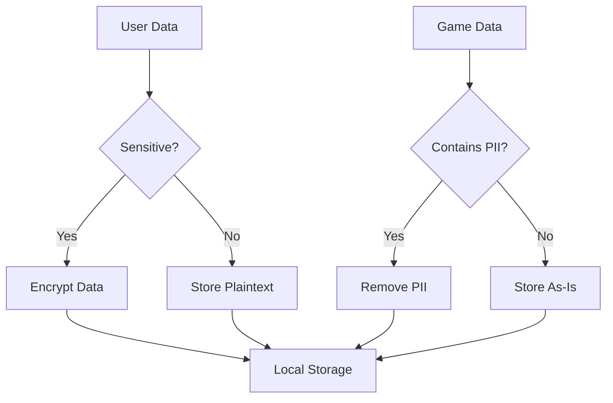
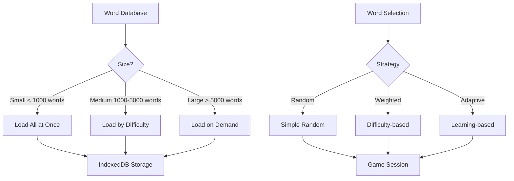
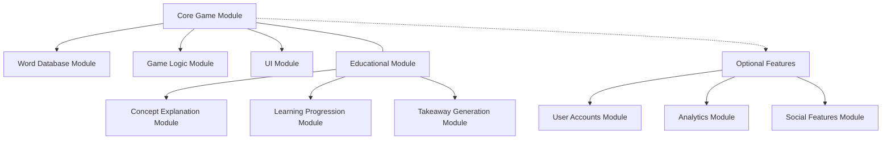

# Words Without Meaning: Security & Scalability Considerations

This document provides detailed guidance on security and scalability considerations for the "Words Without Meaning" game. It outlines strategies to ensure the application is secure, performs well under load, and can scale to accommodate growth in users and content.

## 1. Security Considerations

### 1.1 Data Security

#### 1.1.1 Local Storage Security

Since the game primarily stores data locally on the user's device, consider the following security measures:



1. **Encryption for Sensitive Data**:
   - Encrypt any potentially sensitive user data before storing in localStorage or IndexedDB
   - Use the Web Crypto API for client-side encryption
   - Example implementation:

```javascript
async function encryptData(data, key) {
  const encoder = new TextEncoder();
  const dataBuffer = encoder.encode(JSON.stringify(data));
  
  const iv = window.crypto.getRandomValues(new Uint8Array(12));
  const encryptedData = await window.crypto.subtle.encrypt(
    { name: 'AES-GCM', iv },
    key,
    dataBuffer
  );
  
  return {
    iv: Array.from(iv),
    data: Array.from(new Uint8Array(encryptedData))
  };
}

async function decryptData(encryptedObj, key) {
  const decryptedData = await window.crypto.subtle.decrypt(
    { name: 'AES-GCM', iv: new Uint8Array(encryptedObj.iv) },
    key,
    new Uint8Array(encryptedObj.data)
  );
  
  const decoder = new TextDecoder();
  return JSON.parse(decoder.decode(decryptedData));
}
```

2. **Data Minimization**:
   - Only store essential data
   - Avoid storing personally identifiable information (PII)
   - Use anonymous identifiers instead of personal information

3. **Secure Storage Access**:
   - Implement access controls for stored data
   - Validate data integrity before use
   - Clear sensitive data when no longer needed

#### 1.1.2 Server-Side Security (if implemented)

If server-side components are added for features like user accounts or leaderboards:

1. **Authentication**:
   - Implement secure authentication using industry standards (OAuth 2.0, JWT)
   - Enforce strong password policies
   - Implement rate limiting for login attempts
   - Use secure cookie settings (HttpOnly, Secure, SameSite)

2. **Authorization**:
   - Implement role-based access control
   - Validate permissions for all operations
   - Apply principle of least privilege

3. **Data Protection**:
   - Encrypt sensitive data at rest
   - Use TLS for all communications
   - Implement proper key management
   - Regular security audits and penetration testing

### 1.2 Web Security

#### 1.2.1 Content Security Policy

Implement a strict Content Security Policy to prevent XSS attacks:

```html
<meta http-equiv="Content-Security-Policy" content="default-src 'self'; script-src 'self'; style-src 'self'; img-src 'self' data:; font-src 'self' data:; connect-src 'self'">
```

This policy:
- Restricts scripts to the same origin
- Restricts styles to the same origin
- Allows images from the same origin and data URIs
- Allows fonts from the same origin and data URIs
- Restricts API connections to the same origin

#### 1.2.2 Input Validation

Implement thorough input validation for all user inputs:

```javascript
function validateUserInput(input, schema) {
  // Example using a validation library like Joi or Yup
  try {
    const validatedData = schema.validate(input);
    return { isValid: true, data: validatedData };
  } catch (error) {
    return { isValid: false, error: error.message };
  }
}

// Example schema for game settings
const settingsSchema = {
  difficulty: (value) => ['easy', 'medium', 'hard'].includes(value),
  roundCount: (value) => [5, 10, 15].includes(value),
  timeLimit: (value) => value >= 0 && value <= 60,
  soundEnabled: (value) => typeof value === 'boolean'
};
```

#### 1.2.3 Secure Dependencies

Maintain secure dependencies:

1. **Regular Updates**:
   - Regularly update all dependencies
   - Use tools like npm audit or Dependabot
   - Implement a vulnerability management process

2. **Dependency Vetting**:
   - Evaluate dependencies before inclusion
   - Prefer well-maintained libraries with security focus
   - Consider using fewer dependencies to reduce attack surface

3. **Subresource Integrity**:
   - Use integrity attributes for third-party resources
   - Example:
   ```html
   <script src="https://example.com/library.js" 
           integrity="sha384-oqVuAfXRKap7fdgcCY5uykM6+R9GqQ8K/uxy9rx7HNQlGYl1kPzQho1wx4JwY8wC" 
           crossorigin="anonymous"></script>
   ```

### 1.3 Privacy Considerations

#### 1.3.1 Data Collection Policy

Implement a clear data collection policy:

1. **Transparency**:
   - Clearly communicate what data is collected
   - Explain how data is used
   - Provide options to opt out where possible

2. **Consent Management**:
   - Obtain explicit consent before collecting data
   - Allow users to withdraw consent
   - Implement age-appropriate design if targeting younger users

3. **Data Lifecycle**:
   - Define retention periods for different data types
   - Implement automatic data purging
   - Provide data export functionality

#### 1.3.2 Analytics Implementation

If implementing analytics:

1. **Anonymous Analytics**:
   - Use anonymized data where possible
   - Avoid collecting PII in analytics
   - Consider privacy-focused analytics alternatives

2. **Local Analytics**:
   - Consider implementing local-only analytics
   - Process data on the client side
   - Only send aggregated data to servers

Example implementation of privacy-respecting analytics:

```javascript
// Privacy-respecting analytics
const analyticsService = {
  // Track event without PII
  trackEvent(category, action, label) {
    // Remove any potential PII from label
    const sanitizedLabel = sanitizeForPII(label);
    
    // Send anonymized data
    if (userHasConsentedToAnalytics()) {
      sendAnalyticsEvent({
        category,
        action,
        label: sanitizedLabel,
        // Use session ID instead of user ID
        sessionId: getAnonymousSessionId(),
        // Include only general device info
        deviceCategory: getDeviceCategory(), // mobile, tablet, desktop
        // No IP address or precise location
      });
    }
  }
};
```

## 2. Scalability Considerations

### 2.1 Content Scalability

#### 2.1.1 Word Database Scaling

Strategies for scaling the word database:



1. **Database Partitioning**:
   - Partition word database by difficulty level
   - Load only the necessary partitions based on user settings
   - Implement progressive loading for large databases

2. **Efficient Indexing**:
   - Create appropriate indexes in IndexedDB
   - Index by difficulty, categories, and other frequently queried fields
   - Example IndexedDB setup:

```javascript
function setupWordDatabase() {
  const request = indexedDB.open("WordsWithoutMeaning", 1);
  
  request.onupgradeneeded = function(event) {
    const db = event.target.result;
    
    // Create words object store
    const wordsStore = db.createObjectStore("words", { keyPath: "id" });
    
    // Create indexes for efficient querying
    wordsStore.createIndex("difficulty", "difficulty", { unique: false });
    wordsStore.createIndex("text", "text", { unique: true });
    wordsStore.createIndex("categories", "categories", { unique: false, multiEntry: true });
  };
}
```

3. **Lazy Loading**:
   - Implement lazy loading for word details
   - Load basic word metadata initially
   - Load full details only when needed
   - Example implementation:

```javascript
async function getWordForRound(wordId) {
  // First try to get from cache
  const cachedWord = wordCache.get(wordId);
  if (cachedWord && cachedWord.hasFullDetails) {
    return cachedWord;
  }
  
  // If not in cache or doesn't have full details, load from database
  const db = await openDatabase();
  const transaction = db.transaction(["words", "meanings"], "readonly");
  
  // Get basic word data
  const word = await transaction.objectStore("words").get(wordId);
  
  // Get meanings separately
  const meaningsIndex = transaction.objectStore("meanings").index("wordId");
  const meanings = await meaningsIndex.getAll(wordId);
  
  // Combine and cache
  word.meanings = meanings;
  word.hasFullDetails = true;
  wordCache.set(wordId, word);
  
  return word;
}
```

#### 2.1.2 Educational Content Scaling

Strategies for scaling educational content:

1. **Content Categorization**:
   - Organize content by linguistic concept
   - Tag content with difficulty levels
   - Create relationships between related concepts

2. **Progressive Disclosure**:
   - Start with basic concepts
   - Gradually introduce more complex concepts
   - Track user exposure to concepts

3. **Content Versioning**:
   - Implement versioning for educational content
   - Allow updates without breaking existing games
   - Support migration between content versions

### 2.2 Performance Scalability

#### 2.2.1 UI Performance

Strategies for maintaining UI performance:

1. **Component Optimization**:
   - Use React.memo for pure components
   - Implement shouldComponentUpdate or React.PureComponent
   - Avoid unnecessary re-renders
   - Example optimization:

```javascript
// Optimized component with memoization
const OptionButton = React.memo(function OptionButton({ text, isSelected, onClick }) {
  return (
    <button 
      className={`option-button ${isSelected ? 'selected' : ''}`}
      onClick={onClick}
    >
      {text}
    </button>
  );
}, (prevProps, nextProps) => {
  // Custom comparison function
  return prevProps.isSelected === nextProps.isSelected && 
         prevProps.text === nextProps.text;
});
```

2. **Render Optimization**:
   - Virtualize long lists
   - Implement pagination for large datasets
   - Defer non-critical rendering
   - Example implementation:

```javascript
// Virtual list for performance
function VirtualizedList({ items, itemHeight, windowHeight, renderItem }) {
  const [scrollTop, setScrollTop] = useState(0);
  
  // Calculate visible items
  const startIndex = Math.floor(scrollTop / itemHeight);
  const endIndex = Math.min(
    items.length - 1,
    Math.floor((scrollTop + windowHeight) / itemHeight)
  );
  
  const visibleItems = [];
  for (let i = startIndex; i <= endIndex; i++) {
    visibleItems.push({
      item: items[i],
      index: i,
      style: {
        position: 'absolute',
        top: `${i * itemHeight}px`,
        height: `${itemHeight}px`
      }
    });
  }
  
  return (
    <div 
      style={{ height: `${windowHeight}px`, overflow: 'auto', position: 'relative' }}
      onScroll={(e) => setScrollTop(e.target.scrollTop)}
    >
      <div style={{ height: `${items.length * itemHeight}px` }}>
        {visibleItems.map(({ item, index, style }) => (
          <div key={index} style={style}>
            {renderItem(item, index)}
          </div>
        ))}
      </div>
    </div>
  );
}
```

3. **Asset Optimization**:
   - Optimize images and media
   - Implement lazy loading for assets
   - Use appropriate formats (WebP for images, MP3/OGG for audio)

#### 2.2.2 State Management Performance

Strategies for efficient state management:

1. **Selective Updates**:
   - Use selectors to prevent unnecessary re-renders
   - Implement efficient state comparison
   - Example with Redux:

```javascript
// Efficient selector with memoization
import { createSelector } from 'reselect';

const getWords = state => state.words;
const getDifficulty = state => state.settings.difficulty;

const getWordsByDifficulty = createSelector(
  [getWords, getDifficulty],
  (words, difficulty) => words.filter(word => word.difficulty === difficulty)
);
```

2. **State Normalization**:
   - Normalize state to avoid duplication
   - Use references instead of embedding objects
   - Example normalized state:

```javascript
// Normalized state structure
const normalizedState = {
  words: {
    byId: {
      'word_001': { id: 'word_001', text: 'bank', difficulty: 'medium', meaningIds: ['meaning_001', 'meaning_002'] },
      'word_002': { id: 'word_002', text: 'run', difficulty: 'easy', meaningIds: ['meaning_003', 'meaning_004'] }
    },
    allIds: ['word_001', 'word_002']
  },
  meanings: {
    byId: {
      'meaning_001': { id: 'meaning_001', wordId: 'word_001', definition: 'Financial institution' },
      'meaning_002': { id: 'meaning_002', wordId: 'word_001', definition: 'River edge' },
      'meaning_003': { id: 'meaning_003', wordId: 'word_002', definition: 'Move quickly' },
      'meaning_004': { id: 'meaning_004', wordId: 'word_002', definition: 'Operate or manage' }
    },
    allIds: ['meaning_001', 'meaning_002', 'meaning_003', 'meaning_004']
  }
};
```

3. **Batch Updates**:
   - Combine multiple state updates
   - Use middleware for complex operations
   - Example batch update:

```javascript
// Batch actions middleware
const batchActionsMiddleware = store => next => action => {
  if (action.type === 'BATCH_ACTIONS' && Array.isArray(action.actions)) {
    action.actions.forEach(batchedAction => {
      store.dispatch(batchedAction);
    });
    return;
  }
  return next(action);
};

// Usage
dispatch({
  type: 'BATCH_ACTIONS',
  actions: [
    { type: 'UPDATE_SCORE', payload: 100 },
    { type: 'COMPLETE_ROUND', payload: { roundId: 'round_1' } },
    { type: 'START_NEXT_ROUND' }
  ]
});
```

### 2.3 User Base Scalability

#### 2.3.1 Client-Side Scaling

Strategies for handling increased user load:

1. **Efficient Resource Loading**:
   - Implement code splitting
   - Use dynamic imports for lazy loading
   - Optimize bundle size
   - Example implementation:

```javascript
// Code splitting with React.lazy
const GameplayScreen = React.lazy(() => import('./GameplayScreen'));
const ResultsScreen = React.lazy(() => import('./ResultsScreen'));

function App() {
  return (
    <React.Suspense fallback={<LoadingSpinner />}>
      <Router>
        <Route path="/play" component={GameplayScreen} />
        <Route path="/results" component={ResultsScreen} />
      </Router>
    </React.Suspense>
  );
}
```

2. **Progressive Web App**:
   - Implement service workers for offline support
   - Use cache strategies for assets
   - Example service worker setup:

```javascript
// Service worker registration
if ('serviceWorker' in navigator) {
  window.addEventListener('load', () => {
    navigator.serviceWorker.register('/service-worker.js')
      .then(registration => {
        console.log('ServiceWorker registered: ', registration);
      })
      .catch(error => {
        console.log('ServiceWorker registration failed: ', error);
      });
  });
}

// service-worker.js
const CACHE_NAME = 'words-without-meaning-v1';
const urlsToCache = [
  '/',
  '/index.html',
  '/static/js/main.bundle.js',
  '/static/css/main.css',
  '/static/media/logo.png'
];

self.addEventListener('install', event => {
  event.waitUntil(
    caches.open(CACHE_NAME)
      .then(cache => {
        return cache.addAll(urlsToCache);
      })
  );
});

self.addEventListener('fetch', event => {
  event.respondWith(
    caches.match(event.request)
      .then(response => {
        if (response) {
          return response;
        }
        return fetch(event.request);
      })
  );
});
```

3. **Performance Monitoring**:
   - Implement client-side performance monitoring
   - Track key metrics (load time, interaction time)
   - Use performance budget

#### 2.3.2 Server-Side Scaling (if implemented)

If server components are added:

1. **Stateless Architecture**:
   - Design stateless services
   - Use token-based authentication
   - Enable horizontal scaling

2. **Caching Strategy**:
   - Implement CDN for static assets
   - Use Redis or similar for server-side caching
   - Implement browser caching with appropriate headers

3. **Database Scaling**:
   - Use database sharding for large datasets
   - Implement read replicas for high-read scenarios
   - Consider NoSQL for certain data types

### 2.4 Feature Scalability

#### 2.4.1 Modular Architecture

Implement a modular architecture to support feature growth:



1. **Feature Flags**:
   - Implement feature flags for gradual rollout
   - Allow enabling/disabling features
   - Example implementation:

```javascript
// Feature flag system
const featureFlags = {
  userAccounts: false,
  advancedAnalytics: false,
  socialSharing: true,
  experimentalWordSuggestions: process.env.NODE_ENV === 'development'
};

function isFeatureEnabled(featureName) {
  return featureFlags[featureName] === true;
}

// Usage
if (isFeatureEnabled('socialSharing')) {
  renderSharingButtons();
}
```

2. **Plugin Architecture**:
   - Design extensible plugin system
   - Allow adding new features without modifying core
   - Example plugin system:

```javascript
// Plugin system
class PluginManager {
  constructor() {
    this.plugins = {};
    this.hooks = {};
  }
  
  registerPlugin(name, plugin) {
    this.plugins[name] = plugin;
    
    // Register hooks
    Object.entries(plugin.hooks || {}).forEach(([hookName, handler]) => {
      if (!this.hooks[hookName]) {
        this.hooks[hookName] = [];
      }
      this.hooks[hookName].push(handler);
    });
    
    // Initialize plugin
    if (typeof plugin.initialize === 'function') {
      plugin.initialize();
    }
  }
  
  executeHook(hookName, context) {
    const handlers = this.hooks[hookName] || [];
    return Promise.all(handlers.map(handler => handler(context)));
  }
}

// Example plugin
const analyticsPlugin = {
  name: 'analytics',
  hooks: {
    'roundCompleted': (context) => {
      trackEvent('round_completed', {
        wordId: context.word.id,
        timeSpent: context.timeSpent,
        isCorrect: context.isCorrect
      });
    },
    'gameCompleted': (context) => {
      trackEvent('game_completed', {
        score: context.score,
        difficulty: context.difficulty,
        roundsPlayed: context.roundsPlayed
      });
    }
  },
  initialize: () => {
    setupAnalyticsService();
  }
};
```

3. **Microservices** (if server components are added):
   - Implement microservices architecture
   - Separate concerns into independent services
   - Use API gateway for client communication

## 3. Monitoring and Optimization

### 3.1 Performance Monitoring

Implement comprehensive performance monitoring:

1. **Client-Side Metrics**:
   - Track page load time
   - Monitor time to interactive
   - Measure frame rate during animations
   - Example implementation:

```javascript
// Performance monitoring
function trackPerformanceMetrics() {
  // Track page load metrics
  if (window.performance) {
    const perfData = window.performance.timing;
    const pageLoadTime = perfData.loadEventEnd - perfData.navigationStart;
    const domReadyTime = perfData.domComplete - perfData.domLoading;
    
    logPerformanceMetric('pageLoadTime', pageLoadTime);
    logPerformanceMetric('domReadyTime', domReadyTime);
  }
  
  // Track runtime performance
  let lastFrameTime = performance.now();
  let frameCount = 0;
  
  function checkFrameRate() {
    const now = performance.now();
    frameCount++;
    
    if (now - lastFrameTime >= 1000) {
      const fps = Math.round((frameCount * 1000) / (now - lastFrameTime));
      logPerformanceMetric('fps', fps);
      
      frameCount = 0;
      lastFrameTime = now;
    }
    
    requestAnimationFrame(checkFrameRate);
  }
  
  requestAnimationFrame(checkFrameRate);
}
```

2. **User Experience Metrics**:
   - Track time to first interaction
   - Measure response time to user actions
   - Monitor error rates

3. **Resource Usage Monitoring**:
   - Track memory usage
   - Monitor IndexedDB size
   - Measure battery impact on mobile

### 3.2 Optimization Strategies

Implement ongoing optimization:

1. **Performance Budget**:
   - Set clear performance targets
   - Monitor against budget
   - Take action when budget is exceeded

2. **Automated Optimization**:
   - Implement automated bundle analysis
   - Use lighthouse CI for performance regression testing
   - Automate image optimization

3. **Adaptive Performance**:
   - Detect device capabilities
   - Adjust features based on device performance
   - Example implementation:

```javascript
// Adaptive performance
function setupAdaptivePerformance() {
  // Detect device performance tier
  const performanceTier = detectPerformanceTier();
  
  // Apply settings based on tier
  switch (performanceTier) {
    case 'low':
      disableAnimations();
      useSimplifiedRendering();
      reduceAssetQuality();
      break;
    case 'medium':
      useModerateAnimations();
      useStandardRendering();
      useStandardAssetQuality();
      break;
    case 'high':
      enableAllAnimations();
      useEnhancedRendering();
      useHighQualityAssets();
      break;
  }
}

function detectPerformanceTier() {
  // Check device memory (if available)
  if (navigator.deviceMemory) {
    if (navigator.deviceMemory < 2) return 'low';
    if (navigator.deviceMemory < 4) return 'medium';
    return 'high';
  }
  
  // Fallback to CPU cores
  if (navigator.hardwareConcurrency) {
    if (navigator.hardwareConcurrency < 4) return 'low';
    if (navigator.hardwareConcurrency < 8) return 'medium';
    return 'high';
  }
  
  // Default to medium if detection fails
  return 'medium';
}
```

## 4. Implementation Recommendations

### 4.1 Security Implementation Checklist

✅ Implement Content Security Policy  
✅ Validate all user inputs  
✅ Encrypt sensitive local data  
✅ Regularly update dependencies  
✅ Implement proper CORS headers (if using server)  
✅ Use HTTPS for all communications  
✅ Implement privacy-respecting analytics  
✅ Add security headers (X-Content-Type-Options, X-Frame-Options)  
✅ Sanitize all displayed data to prevent XSS  
✅ Implement subresource integrity for third-party resources  

### 4.2 Scalability Implementation Checklist

✅ Implement efficient IndexedDB schema with proper indexes  
✅ Use lazy loading for code and assets  
✅ Implement component memoization for performance  
✅ Normalize Redux state  
✅ Implement service workers for offline support  
✅ Use code splitting for large components  
✅ Implement virtual lists for large datasets  
✅ Add performance monitoring  
✅ Implement adaptive performance based on device capabilities  
✅ Design modular architecture with feature flags  

### 4.3 Priority Recommendations

1. **Security Foundations**:
   - Implement CSP and security headers from the start
   - Set up proper input validation
   - Establish secure data handling practices

2. **Performance Foundations**:
   - Design efficient data structures
   - Implement proper IndexedDB schema
   - Set up code splitting and lazy loading

3. **Scalability Foundations**:
   - Design modular architecture
   - Implement feature flags
   - Set up performance monitoring

## 5. Conclusion

Security and scalability are critical aspects of the "Words Without Meaning" game architecture. By implementing the recommendations in this document, the application will be well-positioned to:

1. **Protect User Data**: Ensure user privacy and data security
2. **Perform Well**: Maintain responsive performance even with large word databases
3. **Scale Effectively**: Support growth in users, content, and features
4. **Adapt to Constraints**: Function well across a range of devices and network conditions

These considerations should be integrated throughout the development process, from initial implementation to ongoing maintenance and feature development.